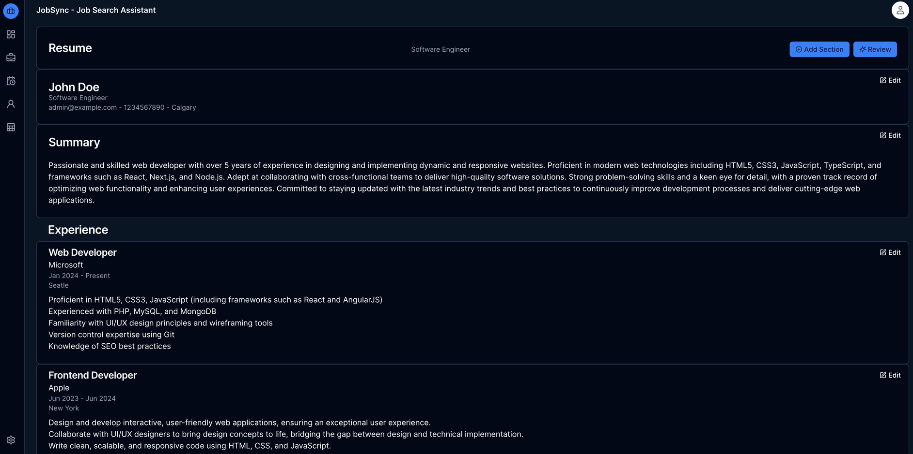
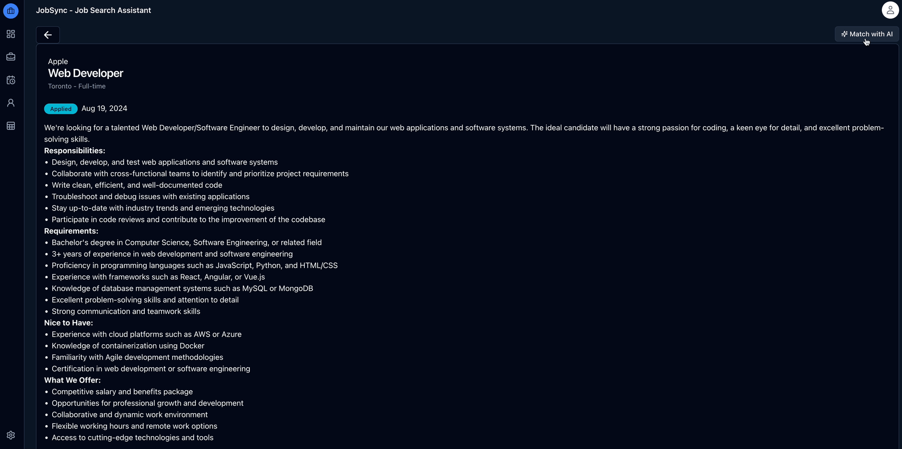

# JobSync - Job Search Assistant

## <a href="https://demo.jobsync.ca">Live Demo</a>

JobSync is a web app companion for managing your job search journey. This free and open-source project is designed to help job seekers efficiently track and organize their job applications. Say goodbye to the chaos of scattered information and hello to a streamlined, intuitive, and powerful job search experience running locally on your system.

Job searching can be overwhelming, with numerous applications to track and deadlines to meet. JobSeeker Assistant is here to simplify this process, allowing you to focus on big picture and keep track of your job search related activities. JobSync app platform empowers you with the tools you need to stay organized, informed, and proactive throughout your job search.

### Dashboard


### Jobs Applied list


### AI Resume review



### AI Job match



## Key Features
- **Application Tracker:** Keep a detailed record of all your job applications, including company details, job titles, application dates, and current status.

- **Monitoring Dashboard:** Visualize your job search progress with an interactive dashboard that provides insights into your application activities, success rates, and upcoming tasks.

- **Resume Management:** Store and manage your resumes, and use it with AI to get reviews and match with job descriptions.

- **Task & Activity Management:** Manage tasks, track activites linked with tasks included with time tracking. 

- **AI Assistant:** Leverage the power of AI to improve your resumes and match with jobs. Get personalized job matching with scoring to identify the best opportunities tailored to your profile.


## Free to Use and Self-Hosted
JobSync Assistant is completely free to use and open source. It provides a powerful job search management tool at no cost and ensures that everyone has access to the resources they need. Additionally, JobSeeker Assistant is designed to be self-hosted, giving you full control over your data. By using Docker, you can easily set up and run JobSync Assistant on your own server, ensuring a secure and personalized experience.


## Installation

### Using Docker

#### Step 1 - Clone repo
* **Alternativey you can also download the source code using download link**

```sh
git clone https://github.com/Gsync/jobsync.git
```

#### Step 2 - Change environment variables
* ** You must create a .env file before proceeding. Refer to .env.example and create or change to .env with your environment variables**
  
#### 2.1 Generate auth secret (Optional) 

These methods will generate a random string that you can use as your AUTH_SECRET. Make sure to set this in your environment variables:

For example, add it to your .env local file:

```sh
AUTH_SECRET="your_generated_secret"
```

**Important**
If you are running it on a remote server/homelab, you must update timezone otherwise activities times may shift

```sh 
TZ=America/Edmonton
```

##### For npm

```sh
    npm exec auth secret
```
OR
```sh
    npx auth secret
```

##### Using the openssl command available on Linux and Mac OS X:

```sh
    openssl rand -base64 33
```

#### 2.2 Change username and password (Optional) 

You can use default username (admin@example) and password (password123) or change it in you .env file

#### Step 3 - Build docker image and run container
* **Please make sure you have <a href="https://www.docker.com">docker</a> installed and running**
* Please make sure you are in you project directory in your terminal

```sh
docker compose up
```

***For Update (Optional)***
Try running deployment script (deploy.sh) - with clone

```sh
 ./deploy.sh
```
OR - without clone

```sh
curl -fsSL https://raw.githubusercontent.com/Gsync/jobsync/main/deploy.sh | sudo bash -s
```

#### Step 4 - Access the app
* **Open [http://localhost:3000](http://localhost:3000) with your browser to access the app.**
* If you encounter port conflicts, please change it in the docker file

### Credits

- <a href="https://github.com/facebook/react">React</a>
- <a href="https://github.com/vercel/next.js">Next</a>
- <a href="https://github.com/shadcn-ui/ui">Shadcn</a>
- <a href="https://github.com/prisma/prisma">Prisma</a>
- <a href="https://github.com/tailwindlabs/tailwindcss">Tailwind</a>
- <a href="https://github.com/ueberdosis/tiptap">Tiptap</a>
- <a href="https://github.com/plouc/nivo">Nivo</a>
- <a href="https://github.com/sqlite/sqlite">Sqlite</a>
- <a href="https://github.com/vercel/ai">Vercel AI-SDK</a>
- <a href="https://github.com/ollama/ollama">Ollama</a>

### AI Integration

#### Ollama (llama3.2)

Works with ollama https://ollama.com to review the resume.

Please make sure ollama is installed and running on the same system to use the resume review and job matching feature.

AI settings will show a list of available models based on what you have in Ollama, has been tested with llama3.2 and qwen 8B variant, please make sure it is downloaded and included in ollama.

***Note:*** It is recommended to increase the ollama context length from default 4k.

#### Deepseek

You must add your valid API key in the env file, also please make sure deepseek provider and model is selected from the settings page, ollama is selected as the default provider.

```
DEEPSEEK_API_KEY=your-deepseek-api-key-here
```

### Note

- If you are updating from an old version and already logged in, please try logging out and login again.

