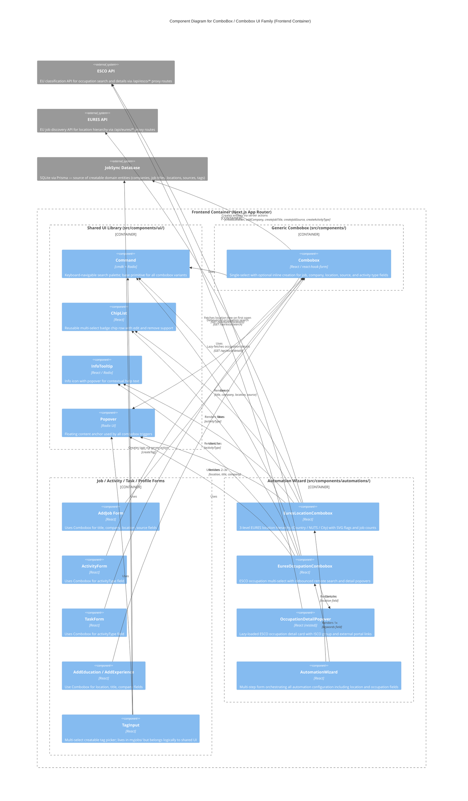

# C4 Component Level: ComboBox / Combobox Component Architecture

## Overview

- **Name**: ComboBox / Combobox UI System
- **Description**: A family of interactive search-and-select controls built on Shadcn Command (cmdk) that handle everything from simple single-value form fields to rich multi-select controls with hierarchical navigation, remote API search, and domain-specific display enrichments.
- **Type**: UI Component Library (client-side, React)
- **Technology**: React 18, Next.js App Router (client components), cmdk, Radix UI Popover, react-hook-form, Tailwind CSS

---

## Purpose

The ComboBox UI system provides type-ahead, searchable selection across the entire JobSync form surface. It appears in job entry forms, activity and task forms, profile sections (education, experience), and the EURES Automation Wizard. Because the three existing implementations were written independently for their domains, they share a recognisable structure but differ significantly in how they source data, how many values can be selected, and how rich the item rendering is.

This document maps each variant, identifies the boundaries between shared and unique concerns, and proposes a layered component hierarchy that would allow the shared mechanics to be extracted without destroying the specialist behaviour in the EURES components.

---

## Existing ComboBox Variants

### Variant 1 — `Combobox` (Generic)

**File**: `src/components/ComboBox.tsx`

| Dimension | Detail |
|---|---|
| Props | `options: any[]`, `field: ControllerRenderProps<any, any>`, `creatable?: boolean` |
| Search / filter | Local, synchronous: `value.includes(search.toLowerCase())` |
| Selection model | Single select — emits `option.id` via `field.onChange` |
| Display | Text label only (`option.label`); checkmark on selected row |
| Creation | Optional (`creatable` prop). When no match found, clicking `CommandEmpty` triggers `onCreateOption(label)` |
| Data source | Caller-supplied static array |
| Form binding | `ControllerRenderProps` (react-hook-form) wrapped in `<FormControl>` |
| Dependencies | `createLocation`, `addCompany`, `createJobTitle`, `createJobSource`, `createActivityType` (server actions); resolved via hard-coded `switch (field.name)` |

**Critical weakness**: The creation dispatch uses `field.name` as a discriminator to call the correct server action. This couples a generic UI component directly to five concrete domain actions and prevents any reuse outside those five specific form fields. Adding a sixth creatable field requires modifying `ComboBox.tsx`.

**Consumers**: `AddJob` (title, company, location, source), `ActivityForm` (activityType), `TaskForm` (activityTypeId → aliased to "activityType"), `AddEducation` (location), `AddExperience` (title, company, location).

---

### Variant 2 — `EuresLocationCombobox`

**File**: `src/components/automations/EuresLocationCombobox.tsx`

| Dimension | Detail |
|---|---|
| Props | `field: ControllerRenderProps<CreateAutomationInput, "location">` |
| Search / filter | Local filter over API-fetched tree; recursive match on `code` and `displayName` |
| Selection model | Multi-select up to 10 (MAX_LOCATIONS); comma-separated codes stored as single string field value |
| Display | SVG country flags (Next.js `<Image>`), NUTS region codes, job counts, expand/collapse chevrons |
| Creation | No — selections are constrained to EURES-defined location codes |
| Data source | Remote: `GET /api/eures/locations` on first popover open; falls back to static `EURES_COUNTRIES` list on error |
| Form binding | `ControllerRenderProps` typed to `CreateAutomationInput.location` |
| Dependencies | `EURES_COUNTRIES`, `EURES_COUNTRY_MAP`, `getLocationLabel`, `getCountryCode` from EURES countries module; `ChipList`, `InfoTooltip`; `formatNumber` from i18n |

**Unique features**:
- Three-level hierarchy: Country → NUTS Region → City (recursive `renderLocationNodes`)
- "All of {Country}" shortcut item when a country with regions is expanded
- SVG flag icons with graceful fallback to placeholder circle on `onError`
- `HelpCircle` icon for "not-specified" (NS) codes
- Chip row with flags rendered below the trigger button
- Inline `InfoTooltip` explaining NUTS codes and NS codes

---

### Variant 3 — `EuresOccupationCombobox`

**File**: `src/components/automations/EuresOccupationCombobox.tsx`

| Dimension | Detail |
|---|---|
| Props | `field: ControllerRenderProps<CreateAutomationInput, "keywords">`, `language?: string` |
| Search / filter | Debounced (300 ms) remote search: `GET /api/esco/search?text=…&language=…&limit=10` |
| Selection model | Multi-select up to 10 (MAX_KEYWORDS); `||`-separated strings stored as single string field value |
| Display | `Briefcase` icon for ESCO results; ISCO code badge; "Custom keyword" group for free-text; `ExternalLink` button for ESCO portal per result row |
| Creation | Hybrid: free-text custom keywords added via Enter key or by clicking "Add keyword" item; ESCO results added as typed occupation titles |
| Data source | Remote ESCO API (`/api/esco/search`, `/api/esco/details`) |
| Form binding | `ControllerRenderProps` typed to `CreateAutomationInput.keywords` |
| Dependencies | `EscoSearchResult`, `EscoOccupationDetails` types from API route modules; `ChipList` with `editable` and `onEdit`; `InfoTooltip`; `OccupationDetailPopover` (nested component) |

**Unique features**:
- `OccupationDetailPopover` — a nested `<Popover>` per chip that lazy-fetches `/api/esco/details?uri=…` and renders ISCO group, description, external links
- ESCO metadata cache (`escoMeta: Map<string, EscoSearchResult>`) stored in component state; survives keyword edits via `editKeyword`
- Chips are editable in-place via `ChipList`'s `editable` + `onEdit` props
- Search result deduplication: already-selected items are filtered from results
- Custom keyword entry does not require an ESCO match

---

### Variant 4 — `TagInput`

**File**: `src/components/myjobs/TagInput.tsx`

While not named "Combobox", this component shares the identical Command + Popover + ChipList pattern and must be considered part of the same family.

| Dimension | Detail |
|---|---|
| Props | `availableTags: Tag[]`, `selectedTagIds: string[]`, `onChange: (ids: string[]) => void` |
| Search / filter | Local: client-side string match on `tag.label.toLowerCase()` |
| Selection model | Multi-select up to 10 (MAX_TAGS); emits `string[]` of IDs |
| Display | Text label only; `CirclePlus` icon on "Create" row |
| Creation | Yes — calls `createTag(label)` server action directly (not via a field-name switch) |
| Data source | Caller-supplied static array; creation appends to local state |
| Form binding | Custom — receives `onChange` prop, not `ControllerRenderProps` |
| Dependencies | `createTag` action; `Badge` (inline chips, not ChipList) |

`TagInput` is the most cleanly factored creatable multi-select: it owns its own creation action explicitly rather than routing through a field-name discriminator.

---

### Variant 5 — `Command` (Base Primitive)

**File**: `src/components/ui/command.tsx`

The Shadcn re-export of `cmdk`. Provides the keyboard navigation, filtering engine, and accessible markup that all four variants above build on. Contains one jobsync-specific modification: `CommandList` sets `style={{ touchAction: "pan-y" }}` to fix mobile scroll.

This is not a consumer-facing component; it is the foundational primitive. No further factoring is needed at this level.

---

## Component Hierarchy Proposal

The analysis above reveals three distinct architectural layers within this family:

```
Layer 1 — Primitive          cmdk + Radix (command.tsx, popover.tsx)
Layer 2 — Shared Mechanics   BaseCombobox hook / headless component
Layer 3 — Specialised UI     Combobox, TagInput, EuresLocationCombobox, EuresOccupationCombobox
```

### Layer 2: Shared Mechanics (what can be unified)

All four variants implement an identical interaction loop:

1. A `<Button role="combobox">` trigger that summarises current selection
2. A `<Popover>` containing a `<Command shouldFilter={false}>` (or with a filter function)
3. A `<CommandInput>` that captures the search string
4. A `<CommandList>` with results, a loading indicator, and an empty state
5. `open` / `inputValue` state management
6. A max-items guard with a disabled trigger when the limit is reached
7. A chip/badge row below the trigger showing selections

The following props interface would cover all four cases:

```typescript
interface BaseComboboxProps<TValue> {
  // Trigger
  triggerLabel: string;           // text shown when nothing selected
  triggerFullLabel?: string;      // text shown when something selected ("{count} selected")
  triggerMaxLabel?: string;       // text shown when limit is reached
  maxItems?: number;              // disable trigger when reached; default: unlimited

  // Search
  placeholder?: string;           // CommandInput placeholder
  onSearch?: (query: string) => void; // called on every keystroke (for debounced remote search)

  // Items
  children: React.ReactNode;      // CommandGroup / CommandItem trees rendered by caller

  // Loading / empty states
  isLoading?: boolean;
  emptyText?: string;

  // Chip row
  chips?: ChipItem[];
  onRemoveChip?: (value: string) => void;
  onEditChip?: (oldValue: string, newValue: string) => void;
  editableChips?: boolean;

  // Popover alignment
  align?: "start" | "center" | "end";

  // Tooltip
  tooltip?: React.ReactNode;
}
```

This is a **headless wrapper with a chip row**, not a prescriptive item renderer. The caller owns the `CommandGroup` / `CommandItem` structure, which preserves the full flexibility needed by `EuresLocationCombobox` (recursive tree) and `EuresOccupationCombobox` (two groups).

### What must remain separate

| Concern | Reason |
|---|---|
| The `switch (field.name)` creation dispatch in `Combobox` | Domain-coupling. Should be lifted to callers via an `onCreateOption` prop. |
| The three-level recursive NUTS hierarchy in `EuresLocationCombobox` | EURES-specific data structure; has no analogue elsewhere. |
| SVG flag rendering (`FlagIcon`) | EURES-specific; depends on `/public/flags/` and country code utilities. |
| ESCO metadata cache and `OccupationDetailPopover` | ESCO-specific; depends on `/api/esco/details` and ISCO classification data. |
| The `||` separator encoding for occupation keywords | Automation schema contract; not a UI concern. |

---

## Refactoring Recommendations

### Recommendation 1 — Decouple creation logic from `Combobox`

Replace the `switch (field.name)` dispatch with an `onCreateOption?: (label: string) => Promise<{ id: string; label: string }>` prop. Each call site supplies its own server action. This removes the five hard-coded action imports and makes `Combobox` usable for any future creatable field.

**Effort**: Low. All five call sites are already within `Form` contexts where the relevant action is in scope.

**Priority**: High. This is the only current architectural defect — the rest is acceptable specialisation.

### Recommendation 2 — Extract a `BaseCombobox` shared wrapper

Create `src/components/ui/base-combobox.tsx` implementing the interface above. `Combobox`, `TagInput`, `EuresLocationCombobox`, and `EuresOccupationCombobox` all adopt it as their outer shell. This eliminates ~50 lines of duplicated Popover + trigger + chip-row boilerplate per variant.

**Effort**: Medium. The trickiest part is matching the chip-row rendering differences (flags vs plain text vs editable chips). The `ChipList` component already handles icons and actions, so the caller merely needs to shape its `chips` array appropriately.

**Priority**: Medium. The duplication is in stable code and is not causing bugs. Prioritise if a fifth combobox variant is planned.

### Recommendation 3 — Move `TagInput` under `src/components/ui/`

`TagInput` is a general-purpose multi-select creatable component with no job-domain logic (the `createTag` action dependency can be extracted via an `onCreate` prop). It belongs next to `ChipList` in the shared UI library, not in `src/components/myjobs/`.

**Effort**: Low.

**Priority**: Low (no functional impact).

### Recommendation 4 — Keep EURES components in `src/components/automations/`

Both `EuresLocationCombobox` and `EuresOccupationCombobox` are tightly coupled to the EURES/ESCO domain: they import EURES country maps, call ESCO API routes, render SVG flags, and embed ISCO classification links. They are correctly co-located with the Automation Wizard that consumes them. Do not attempt to generalise them into the shared UI library.

---

## Software Features by Component

### `Combobox` (Generic)

- Type-ahead single-select for any list of `{ id, label, value }` items
- Client-side local search filter
- Optional inline item creation with creation feedback (spinner during server action)
- react-hook-form `ControllerRenderProps` integration
- Selected value display via label lookup

### `EuresLocationCombobox`

- Multi-select of EURES location codes (countries, NUTS regions, cities)
- Three-level collapsible location hierarchy
- Remote data fetch from `/api/eures/locations` on first open with static fallback
- SVG country flag icons with error fallback
- Job count badges per location
- Maximum 10 selections with disabled trigger guard
- Comma-separated field value encoding
- "All of {Country}" shortcut entry
- NS (not-specified) region indicator
- ChipList with flag icons for selected locations
- InfoTooltip explaining NUTS and NS codes

### `EuresOccupationCombobox`

- Multi-select of ESCO occupation titles and free-text custom keywords
- Debounced (300 ms) remote ESCO search via `/api/esco/search`
- Hybrid creation: structured ESCO result or free-text Enter key
- ISCO code display per ESCO result
- External link to ESCO portal per result row
- OccupationDetailPopover: lazy-fetched occupation detail card with ISCO group hierarchy and EURES job search link
- ESCO metadata cache (uri → EscoSearchResult) maintained across chip edits
- Editable chips — keyword text can be modified in-place post-selection
- `||`-separated field value encoding
- Maximum 10 keywords with disabled trigger guard
- InfoTooltip explaining ESCO, custom keywords, and ISCO groups

### `TagInput`

- Multi-select with inline tag creation
- Client-side local filter on available tags
- Duplicate detection (exact match suppresses "Create" row)
- Maximum 10 tags with disabled trigger guard
- Badge chip row with remove buttons

### `Command` (Base Primitive)

- Keyboard-navigable command palette built on cmdk
- Accessible ARIA combobox role
- Custom filter function support (`shouldFilter={false}` for externally filtered lists)
- Mobile scroll fix (`touchAction: pan-y` on `CommandList`)
- `CommandDialog` wrapper for full-screen command palette use case

---

## Dependencies Between Components

| Consumer | Depends On |
|---|---|
| `Combobox` | `Command*`, `Popover*`, `ScrollArea`, `Button`, `FormControl`, `useTranslations` |
| `EuresLocationCombobox` | `Command*`, `Popover*`, `Button`, `ChipList`, `InfoTooltip`, `Image` (Next.js), EURES countries module, `useTranslations`, `formatNumber` |
| `EuresOccupationCombobox` | `Command*`, `Popover*`, `Button`, `ChipList`, `InfoTooltip`, ESCO API route types, `useTranslations` |
| `TagInput` | `Command*`, `Popover*`, `Button`, `Badge`, `createTag` action, `useTranslations` |

---

## Component Diagram

The diagram below shows the combobox component family within the **Frontend Container** and their relationships with each other, with shared UI primitives, and with external data sources.



---

## Summary: Shared vs Unique Functionality

| Concern | `Combobox` | `TagInput` | `EuresLocation` | `EuresOccupation` | Can Unify? |
|---|---|---|---|---|---|
| Popover + trigger button | Yes | Yes | Yes | Yes | Yes — `BaseCombobox` |
| `open` / `inputValue` state | Yes | Yes | Yes | Yes | Yes — `BaseCombobox` |
| `CommandInput` search | Yes | Yes | Yes | Yes | Yes — `BaseCombobox` |
| Loading indicator | No | No | Yes | Yes | Yes — `BaseCombobox` |
| Max-items guard | No | Yes | Yes | Yes | Yes — `BaseCombobox` |
| Chip row below trigger | No | Inline `Badge` | `ChipList` + flags | `ChipList` editable | Partial — caller shapes `chips[]` |
| Local sync filter | Yes | Yes | No | No | N/A — already diverged |
| Remote async fetch | No | No | Yes (one-shot) | Yes (debounced) | No — too different |
| Item creation | Domain switch | Single action | No | Hybrid | No — lift to callers |
| Hierarchical tree items | No | No | Yes (recursive) | No | No — EURES-specific |
| SVG flags | No | No | Yes | No | No — EURES-specific |
| ESCO metadata cache | No | No | No | Yes | No — ESCO-specific |
| Detail popover per chip | No | No | No | Yes | No — ESCO-specific |
| Editable chips | No | No | No | Yes | Kept in `ChipList` |
| react-hook-form binding | `ControllerRenderProps` | Custom `onChange` | `ControllerRenderProps` | `ControllerRenderProps` | Both patterns are valid |
