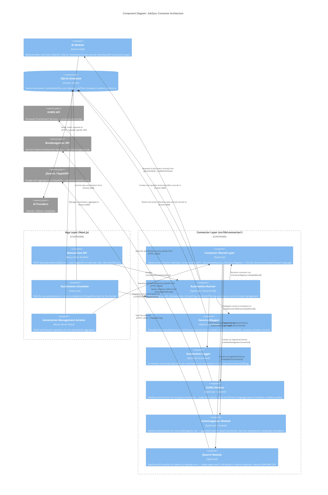

# C4 Component Level: Connector Architecture

## Overview

- **Name**: Connector Architecture
- **Description**: The Anti-Corruption Layer (ACL) that bridges the JobSync application domain with external job board APIs, mediating all job discovery automation
- **Type**: Library (server-side, Next.js App Router context)
- **Technology**: TypeScript, Node.js, Vercel AI SDK, cockatiel (resilience), node-cron, Prisma

## Purpose

The Connector Architecture translates the incompatible protocols of external job boards (EURES, Bundesagentur, RapidAPI/Google Jobs) into the canonical `DiscoveredVacancy` domain type that the JobSync application understands. It is the sole integration point for job discovery automations.

The layer enforces three architectural invariants:

1. **Single shared language**: All external data crosses the ACL boundary as `DiscoveredVacancy`. No module-specific types leak into the App layer.
2. **Uniform error model**: Every operation returns `ConnectorResult<T>` — a discriminated union of success and typed failure. Exceptions never propagate across the ACL boundary.
3. **Pluggable modules**: New job boards are added by implementing `DataSourceConnector` and registering a factory in `ConnectorRegistry`. No other code changes are required.

> **Note**: The Roadmap 0.1 connector restructuring is complete. Source files are located at `src/lib/connector/job-discovery/` with module implementations in the `modules/` subdirectory. AI providers have been moved to `src/lib/connector/ai-provider/`.

---

## Components

The Connector Architecture container is composed of six logical components.

---

### 1. Connector Shared Layer

**Files**: `src/lib/connector/job-discovery/types.ts`, `src/lib/connector/job-discovery/registry.ts`, `src/lib/connector/job-discovery/connectors.ts`, `src/lib/connector/job-discovery/index.ts`

**Purpose**: Defines the shared domain language and the plugin registry that binds the App layer to the module implementations. This is the ACL kernel — everything else depends on it but it depends on nothing module-specific.

**Software Features**:

- `DataSourceConnector` interface: the contract every module must fulfil (`id`, `name`, `requiresApiKey`, `search()`, optional `getDetails()`)
- `ConnectorResult<T>` discriminated union: wraps every module response as `{ success: true; data: T }` or `{ success: false; error: ConnectorError }`
- `ConnectorError` sum type: four error variants (`blocked`, `rate_limited`, `network`, `parse`) that map to `AutomationRunStatus` without leaking HTTP status codes
- `SearchParams`: the canonical search input crossing into the ACL (`keywords`, `location`, `connectorParams?`)
- `DiscoveredVacancy`: the canonical output type — the shared language of the entire job discovery domain
- `ConnectorRegistry`: factory-based plugin registry; modules self-register via `register(id, factory)` and are instantiated on demand via `create(id)`
- Public barrel (`index.ts`): single import surface exposing types, utilities, registry, and `runAutomation` to the rest of the application

**Interfaces**:

#### `DataSourceConnector` (TypeScript interface)

```
search(params: SearchParams): Promise<ConnectorResult<DiscoveredVacancy[]>>
getDetails?(externalId: string): Promise<ConnectorResult<DiscoveredVacancy>>
```

#### `ConnectorRegistry`

```
register(id: string, factory: () => DataSourceConnector): void
create(id: string): DataSourceConnector
has(id: string): boolean
availableConnectors(): string[]
```

---

### 2. Automation Runner

**Files**: `src/lib/connector/job-discovery/runner.ts`, `src/lib/connector/job-discovery/schedule.ts`

**Purpose**: Orchestrates the end-to-end lifecycle of a single automation run. Coordinates the connector call, deduplication, AI matching, persistence, and run-state management. This is the highest-level component in the Connector layer; it is the only component with knowledge of both the Connector contracts and the App domain models (`Automation`, `AutomationRun`, `Resume`).

**Software Features**:

- **Search execution**: resolves the correct module via `ConnectorRegistry`, calls `search()`, translates connector errors to `AutomationRunStatus`
- **Detail enrichment**: if the module supports `getDetails()`, fetches full vacancy data for each deduplicated job (capped at `MAX_JOBS_PER_RUN = 10`)
- **URL deduplication**: normalises source URLs (stripping tracking parameters) and filters against the user's existing job records; prevents duplicate entries across runs
- **AI job matching**: sends each vacancy and the user's resume to the AI provider using the `matchJobToResume` function; uses structured output (`JobMatchSchema`) to obtain a numeric match score
- **Threshold filtering**: discards vacancies whose AI match score falls below the automation's `matchThreshold`
- **Persistence**: delegates vacancy-to-job-record translation to the Vacancy Mapper, then persists via Prisma
- **Run lifecycle management**: creates `AutomationRun` on start, updates it on completion with metrics (`jobsSearched`, `jobsDeduplicated`, `jobsProcessed`, `jobsMatched`, `jobsSaved`) and final `AutomationRunStatus`
- **Schedule maintenance**: recalculates `nextRunAt` on the parent `Automation` record after every run using `calculateNextRunAt`
- **Structured logging**: emits structured `AutomationLog` events throughout execution via `AutomationLoggerService`

**Public interface**:

```
runAutomation(automation: Automation): Promise<RunnerResult>

RunnerResult {
  runId: string
  status: AutomationRunStatus
  jobsSearched: number
  jobsDeduplicated: number
  jobsProcessed: number
  jobsMatched: number
  jobsSaved: number
  errorMessage?: string
  blockedReason?: string
}
```

**Schedule utilities**:

```
calculateNextRunAt(scheduleHour: number): Date
isAutomationDue(nextRunAt: Date | null): boolean
```

---

### 3. Vacancy Mapper

**Files**: `src/lib/connector/job-discovery/mapper.ts`, `src/lib/connector/job-discovery/utils.ts`

**Purpose**: Translates a `DiscoveredVacancy` value object into a Prisma-compatible job record, resolving or creating all required reference entities (job title, company, location, job source, default status) via fuzzy matching to avoid duplicates.

**Software Features**:

- **Reference-data resolution**: `findOrCreate` pattern for `JobTitle`, `Company`, `Location`, and `JobSource` — performs keyword-based fuzzy matching before creating new entities
- **URL normalisation**: strips UTM and tracking parameters from source URLs using `normalizeJobUrl`
- **String normalisation**: `normalizeForSearch` produces slug-format keys for consistent de-duplication across the reference tables
- **Keyword extraction**: `extractKeywords` splits titles and company names into meaningful tokens, filtering stop words, to support fuzzy matching
- **City extraction**: `extractCityName` parses free-text location strings for city-level fuzzy matching
- **Default status bootstrapping**: ensures a `JobStatus("new")` row exists on first run

**Interface**:

```
mapDiscoveredVacancyToJobRecord(input: {
  vacancy: DiscoveredVacancy
  userId: string
  automationId: string
  matchScore: number
  matchData: string
}): Promise<MapperOutput>
```

---

### 4. EURES Module

**Files**: `src/lib/connector/job-discovery/modules/eures/index.ts`, `src/lib/connector/job-discovery/modules/eures/translator.ts`, `src/lib/connector/job-discovery/modules/eures/resilience.ts`, `src/lib/connector/job-discovery/modules/eures/rate-limiter.ts`, `src/lib/connector/job-discovery/modules/eures/types.ts` (autocomplete), `src/lib/connector/job-discovery/modules/eures/generated.ts` (OpenAPI types), `src/lib/connector/job-discovery/modules/eures/countries.ts`

**Purpose**: Implements `DataSourceConnector` for the EU EURES job portal (`europa.eu/eures/api`). Handles pagination over the EURES search API, language-aware vacancy translation, resilient HTTP communication, and optional detail enrichment.

**Bounded context language**: `jvProfiles`, `locationCodes`, `requestLanguage`, `occupationUris`, `positionScheduleCodes`, `jvProfiles`

**Software Features**:

- **Paginated search**: POST to EURES search endpoint with cursor-based pagination (`resultsPerPage = 50`) until all records are fetched
- **Multi-keyword support**: splits `||`-delimited keyword strings into EURES `keywords[]` array with `specificSearchCode: "EVERYWHERE"`
- **Language-aware translation**: `translateEuresVacancy` (search) and `translateDetail` (detail) select the correct `jvProfiles` language slot; fall back to first available profile if requested language is absent
- **Detail enrichment**: `getDetails(externalId)` fetches the single-vacancy detail endpoint and merges rich fields (`applicationDeadline`, `applicationInstructions`, full `description`)
- **Resilience policy**: `euresPolicy` = retry (3 attempts, exponential backoff) + circuit breaker (5 consecutive failures, 30 s half-open) + timeout (15 s) + bulkhead (5 concurrent, queue 10)
- **Token-bucket rate limiting**: 3 tokens / 500 ms, shared across all requests from this module instance
- **HTML stripping**: normalises HTML markup from EURES descriptions into clean plain text with preserved paragraph structure
- **Type safety**: OpenAPI-generated types (`generated.ts`) provide compile-time contracts against the EURES API schema

**Connector registration id**: `"eures"`
**Requires API key**: No

---

### 5. Arbeitsagentur Module

**Files**: `src/lib/connector/job-discovery/modules/arbeitsagentur/index.ts`, `src/lib/connector/job-discovery/modules/arbeitsagentur/types.ts`, `src/lib/connector/job-discovery/modules/arbeitsagentur/resilience.ts`

**Purpose**: Implements `DataSourceConnector` for the German Federal Employment Agency job portal (`rest.arbeitsagentur.de/jobboerse`). Translates the Bundesagentur-specific vocabulary (`refnr`, `beruf`, `arbeitsort`, `arbeitszeit`, `stellenbeschreibung`) into `DiscoveredVacancy`.

**Bounded context language**: `refnr`, `hashId`, `arbeitsort`, `arbeitszeit` (vz/tz/snw/mj/ho), `stellenbeschreibung`, `beruf`, `bewerbung`, `verguetung`, `befristung`, `aktuelleVeroeffentlichungsdatum`

**Software Features**:

- **Paginated search**: GET requests with 0-based page index; stops when `allVacancies.length >= maxErgebnisse` or page is incomplete
- **Connector-specific params**: `umkreis` (radius km), `veroeffentlichtseit` (days since published), `arbeitszeit` (full/part-time filter), `befristung` (contract type)
- **Employment type mapping**: translates `vz`/`tz` codes to the canonical `full_time`/`part_time` union
- **Search-to-detail translation**: search response uses `beruf` (teaser); detail response provides `stellenbeschreibung` (full description) — `getDetails()` merges these correctly
- **Detail URL construction**: builds canonical portal URLs using `hashId` when available, falling back to `refnr`-based search URL
- **Resilience policy**: `arbeitsagenturPolicy` = retry (3, exponential backoff) + circuit breaker (5 consecutive, 30 s) + timeout (15 s) + bulkhead (5/10) — mirrors EURES policy
- **Token-bucket rate limiting**: 3 tokens / 500 ms (shares `TokenBucketRateLimiter` implementation from EURES module)
- **HTML stripping**: same multi-pass HTML normalisation as EURES module
- **Typed API contract**: hand-authored TypeScript interfaces (`types.ts`) documenting the Arbeitsagentur v4 response schema

**Connector registration id**: `"arbeitsagentur"`
**Requires API key**: No (uses static `X-API-Key: jobboerse-jobsuche`)

---

### 6. JSearch Module

**Files**: `src/lib/connector/job-discovery/modules/jsearch/index.ts`

**Purpose**: Implements `DataSourceConnector` for JSearch via RapidAPI, which aggregates Google Jobs results. Simpler than the EU modules — no pagination, no resilience policy, single-page response with full job details in the search result.

**Bounded context language**: `job_id`, `job_title`, `employer_name`, `job_city`, `job_state`, `job_employment_type`, `job_apply_link`, `job_min_salary`, `job_max_salary`, `job_salary_period`

**Software Features**:

- **Single-page keyword search**: GET to `jsearch.p.rapidapi.com/search` with `date_posted=week`; returns up to one page (no pagination needed — full details already in search response)
- **Search-only (no `getDetails`)**: JSearch returns complete job details in the search response; the `getDetails` method is intentionally absent
- **Salary formatting**: constructs a human-readable salary range string from `job_min_salary`, `job_max_salary`, and `job_salary_period`
- **Employment type mapping**: normalises JSearch's free-text employment type strings to the canonical union
- **API key validation**: returns a typed `network` error on startup if `RAPIDAPI_KEY` is absent, before making any HTTP call
- **HTTP error mapping**: 429 → `rate_limited`, 403 → `blocked` (with human-readable reason), other non-OK → `network`

**Connector registration id**: `"jsearch"`
**Requires API key**: Yes (`RAPIDAPI_KEY` environment variable)

---

### 7. Automation Logger

**Files**: `src/lib/automation-logger.ts`

**Purpose**: In-process, in-memory structured log sink for live automation run streaming. Holds a `LogStore` per running automation and exposes logs to the API streaming endpoint. Logs are retained for 1 hour after run completion, then garbage-collected.

**Software Features**:

- **Per-run log store**: maintains a `Map<automationId, LogStore>` with run state (`isRunning`, `startedAt`, `completedAt`)
- **Structured log entries**: `AutomationLog` records carry `timestamp`, `level` (info/success/warning/error), `message`, and optional `metadata`
- **Bounded log buffer**: caps at 500 log entries per run to prevent unbounded memory growth; oldest entries are evicted
- **Run lifecycle hooks**: `startRun(id)` / `endRun(id)` manage store creation and completion timestamp
- **Log access**: `getLogs(id)` and `getStore(id)` for use by the streaming API route
- **Automatic cleanup**: `setTimeout` schedules `clearLogs` after `LOG_RETENTION_MS` (1 hour) following run completion

**Interface**:

```
automationLogger.startRun(automationId: string): void
automationLogger.endRun(automationId: string): void
automationLogger.log(automationId, level, message, metadata?): void
automationLogger.getLogs(automationId: string): AutomationLog[]
automationLogger.getStore(automationId: string): LogStore | undefined
automationLogger.isRunning(automationId: string): boolean
```

---

### 8. Automation Scheduler

**Files**: `src/lib/scheduler/index.ts`

**Purpose**: The server-side background task that polls for automations whose `nextRunAt` has passed and dispatches them to the Automation Runner. Runs as a `node-cron` scheduled task within the Next.js server process.

**Software Features**:

- **Cron-based polling**: scheduled via `SCHEDULER_CONSTANTS.CRON_EXPRESSION`; checks for due automations on each tick
- **Due automation query**: `db.automation.findMany({ status: "active", nextRunAt: { lte: now } })`
- **Sequential dispatch**: runs due automations one at a time to avoid resource contention on a single-server deployment
- **Resume guard**: skips automations without an associated resume and creates a failed `AutomationRun` record
- **Lifecycle management**: `startScheduler()`, `stopScheduler()`, `isSchedulerRunning()` — controlled from Next.js instrumentation hooks
- **Single-instance guard**: prevents double-starting via a module-level `scheduledTask` reference

**Interface**:

```
startScheduler(): void
stopScheduler(): void
isSchedulerRunning(): boolean
```

---

### 9. Manual Run API

**Files**: `src/app/api/automations/[id]/run/route.ts`

**Purpose**: HTTP endpoint enabling user-triggered automation runs outside the scheduled cycle. Enforces per-user rate limiting (5 runs/hour) and delegates execution to the Automation Runner.

**Software Features**:

- **Authentication guard**: requires valid NextAuth session; returns 401 for unauthenticated requests
- **Ownership check**: verifies the automation belongs to the requesting user before executing
- **Per-user rate limiting**: sliding window limiter (5 runs per 60-minute window) using an in-memory `Map<userId, timestamp[]>`; returns 429 on excess
- **Resume check**: returns 400 with a human-readable message if the automation has no linked resume
- **Result projection**: returns a `RunnerResult` subset as JSON (`runId`, `status`, metrics, `errorMessage`, `blockedReason`)

**Interface**:

```
POST /api/automations/[id]/run → RunnerResult projection
  401 Not Authenticated
  400 Resume missing
  404 Automation not found
  429 Rate limit exceeded (max 5/hour)
  500 Unexpected runner failure
```

---

### 10. Automation Management Actions

**Files**: `src/actions/automation.actions.ts`

**Purpose**: Server Actions (Next.js "use server") serving as the Repository for the Automation aggregate. Handles all CRUD, lifecycle state transitions, and discovered-job review workflows. Not a part of the Connector layer per se, but the primary App-layer consumer of the Connector's schedule utilities.

**Software Features**:

- **CRUD**: `createAutomation`, `updateAutomation`, `deleteAutomation`, `getAutomationsList`, `getAutomationById`
- **Lifecycle**: `pauseAutomation` (clears `nextRunAt`), `resumeAutomation` (recalculates `nextRunAt` via `calculateNextRunAt`)
- **Run history**: `getAutomationRuns(automationId)`
- **Discovered job review**: `getDiscoveredJobs`, `getDiscoveredJobById`, `acceptDiscoveredJob`, `dismissDiscoveredJob`
- **Cap enforcement**: maximum 10 automations per user
- **Schema validation**: all inputs parsed through Zod schemas (`CreateAutomationSchema`, `UpdateAutomationSchema`)

---

## Component Relationships

| Consumer | Dependency | Contract |
|---|---|---|
| Automation Runner | Connector Shared Layer | `ConnectorRegistry.create()` → `DataSourceConnector.search()` / `getDetails()` |
| Automation Runner | Vacancy Mapper | `mapDiscoveredVacancyToJobRecord()` |
| Automation Runner | Automation Logger | `automationLogger.log()` / `startRun()` / `endRun()` |
| Automation Runner | AI Module | `getModel()`, `generateText()`, `JobMatchSchema` |
| Automation Scheduler | Automation Runner | `runAutomation()` |
| Manual Run API | Automation Runner | `runAutomation()` |
| Automation Management Actions | Schedule Utilities | `calculateNextRunAt()` |
| Connector Shared Layer | EURES Module | factory registration via `connectorRegistry.register("eures", ...)` |
| Connector Shared Layer | Arbeitsagentur Module | factory registration via `connectorRegistry.register("arbeitsagentur", ...)` |
| Connector Shared Layer | JSearch Module | factory registration via `connectorRegistry.register("jsearch", ...)` |
| EURES Module | Resilience / Rate Limiter | `resilientFetch()`, `TokenBucketRateLimiter` |
| Arbeitsagentur Module | Resilience / Rate Limiter | `resilientFetch()`, shared `TokenBucketRateLimiter` |

---

## Component Diagram



---

## Data Flows

### Scheduled Automation Run

```
Scheduler (cron tick)
  → db.automation.findMany(status=active, nextRunAt≤now)
  → runAutomation(automation)
    → automationLogger.startRun(id)
    → db.automationRun.create(status=running)
    → db.resume.findUnique(resumeId) — full sections for AI matching
    → connectorRegistry.create(jobBoard)
    → connector.search({ keywords, location, connectorParams })
      → [module] resilientFetch → External API
      → [module] translate* → DiscoveredVacancy[]
    → [if connector.getDetails exists] connector.getDetails(externalId) × N
    → db.job.findMany(userId) — URL set for deduplication
    → [for each new vacancy, capped at 10]
        → matchJobToResume(vacancy, resume, aiSettings)
            → getModel(provider, model)
            → generateText({ system, prompt, output: JobMatchSchema })
        → [if score >= matchThreshold]
            → mapDiscoveredVacancyToJobRecord(vacancy, ...)
                → findOrCreate JobTitle, Company, Location, JobSource
            → db.job.create(record)
    → db.automationRun.update(status, metrics, completedAt)
    → db.automation.update(lastRunAt, nextRunAt)
    → automationLogger.endRun(id)
```

### Manual Run (API Route)

```
POST /api/automations/[id]/run
  → auth() — session check
  → checkRateLimit(userId) — 5/hour sliding window
  → db.automation.findFirst(id, userId)
  → runAutomation(automation) [same flow as above]
  → NextResponse.json(RunnerResult projection)
```

### Discovered Vacancy State Transitions

```
DiscoveryStatus:
  "new"       ← initial state set by Vacancy Mapper on db.job.create
  "accepted"  ← acceptDiscoveredJob() action
  "dismissed" ← dismissDiscoveredJob() action
```

---

## Key Design Decisions

### ACL Pattern

External job board vocabularies are fully encapsulated within their respective modules. The `DiscoveredVacancy` type is the only permitted representation at the ACL boundary. This protects the App domain from changes in any single job board's API contract.

### ConnectorResult over Exceptions

No module is permitted to throw exceptions across the ACL boundary. All failure modes are encoded as typed `ConnectorError` variants. This makes error handling exhaustive and testable at the Runner level without try/catch wrappers on individual connector calls.

### Resilience Isolation

Each module owns its own resilience policy instance (circuit breaker, bulkhead). A EURES circuit trip does not affect the Arbeitsagentur circuit breaker. JSearch (currently without cockatiel) relies on HTTP-level error handling; adding a resilience policy requires only changes to `jsearch/index.ts`.

### Factory-Based Registry

`ConnectorRegistry` holds factories, not instances. Each call to `registry.create(id)` produces a fresh connector with its own rate-limiter state. This enables safe concurrent runs (e.g., multiple users running the same connector simultaneously) without shared mutable state.

### Cap at 10 Jobs per Run

`MAX_JOBS_PER_RUN = 10` in `runner.ts` limits downstream AI API costs. Detail enrichment also respects this cap — at most 10 `getDetails` calls are made per run, after deduplication.

---

## Future Architecture Notes (Roadmap)

- **Roadmap 0.1 complete**: Connector unification done. Job discovery modules at `src/lib/connector/job-discovery/modules/`, AI provider modules at `src/lib/connector/ai-provider/modules/`. See ADR-010.
- **Connector marketplace**: Settings UI to activate/deactivate individual connectors and modules; pauses dependent automations on deactivation (documented in CLAUDE.md).
- **New job discovery modules**: Implement by creating `src/lib/connector/job-discovery/modules/{name}/index.ts` (implements `DataSourceConnector`) and registering in `connectors.ts`. No changes to Runner, Mapper, Scheduler, or Manual Run API are needed.
- **New AI provider modules**: Implement by creating `src/lib/connector/ai-provider/modules/{name}/` implementing `AIProviderConnector`.
- **Domain Events** (Roadmap Section 5): `JobDiscovered` events should be emitted from the Runner on successful job persistence, enabling future CRM and notification integrations without coupling to the Runner directly.
