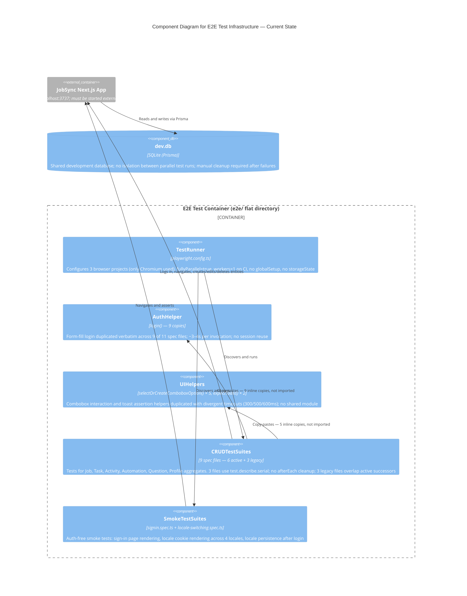

# C4 Component Level: E2E Test Infrastructure — Current (Pre-Refactor) Architecture

## Overview

- **Name**: E2E Test Infrastructure (Current)
- **Description**: The existing Playwright end-to-end test suite covering authentication, CRUD operations for six aggregates, and locale/smoke checks. Components exist only implicitly — no shared modules, no global setup, no storageState — and have emerged organically through copy-paste rather than deliberate design.
- **Type**: Test Infrastructure (Playwright, TypeScript)
- **Technology**: Playwright 1.x, Chromium (system binary on NixOS), TypeScript, SQLite dev.db (shared)

---

## Purpose

The current suite provides regression coverage for the core JobSync user journeys: signing in, creating and deleting jobs, tasks, activities, automations, questions, and profile resumes. It is the only automated browser-level safety net in the project.

Because the suite was grown incrementally without a shared helper layer, implementation knowledge is scattered across eleven independent spec files. Every file that needs authentication re-implements the same `login()` function. Every file that needs to interact with a combobox re-implements `selectOrCreateComboboxOption()` with slightly different timeout constants. Three legacy files test domains that are now fully covered by newer CRUD files, creating duplicate test coverage with no clear owner.

This document maps the implicit components that have emerged from the current structure, characterises their boundaries and defects, and serves as the baseline for the target architecture design.

---

## Implicit Components

### Component 1 — `TestRunner`

**Source**: `playwright.config.ts`

| Dimension | Detail |
|---|---|
| Test directory | `./e2e` (flat, no subdirectory structure) |
| Parallel mode | `fullyParallel: true` (enabled globally) |
| Configured browsers | 3 projects: `chromium`, `firefox`, `webkit` |
| Actually used | Chromium only (Firefox/WebKit carry no system binaries in the NixOS environment) |
| Workers on CI | `workers: process.env.CI ? 1 : undefined` — serial execution on CI negates `fullyParallel` |
| Retries | 2 on CI, 0 locally |
| Global setup | None — no `globalSetup` hook, no `storageState`, no auth pre-seeding |
| Dev server | `reuseExistingServer: true` — must be started externally before tests |
| Base URL | `http://localhost:3737` |

The absence of a `globalSetup` entry means every spec file is responsible for authenticating itself. The `fullyParallel: true` setting is functionally overridden on CI by `workers: 1`, making the entire suite serial there. The three browser projects create visual noise in configuration without providing value: they are never exercised together.

---

### Component 2 — `AuthHelper`

**Source**: `login()` function, copy-pasted into 9 of 11 spec files

| Dimension | Detail |
|---|---|
| Implementation count | 9 identical copies (activity-crud, add-job, automation-crud, job-crud, profile, profile-management, question-crud, task-crud, tasks) |
| Signature | `async function login(page: Page): Promise<void>` |
| Credentials | Hard-coded: `admin@example.com` / `password123` |
| Mechanism | Form fill → button click; no storageState reuse |
| Cost per invocation | ~3–4 seconds (full page load + form interaction + redirect wait) |
| Auth-free files | `signin.spec.ts`, `locale-switching.spec.ts` — these do not import login |

The `locale-switching.spec.ts` file defines its own locale-aware `login()` variant with a different signature (`login(page, strings)`) that accepts translated label strings. This is technically a sixth copy with a different contract, not a reuse of the standard helper.

Every spec file calls `login()` inside `test.beforeEach`, meaning every individual test pays the full 3–4 second authentication cost. Across ~42 tests, this totals more than two minutes of pure login overhead per full run.

---

### Component 3 — `UIHelpers`

**Source**: `selectOrCreateComboboxOption()` in 5 files; `expectToast()` in 2 files

#### `selectOrCreateComboboxOption(page, label, searchPlaceholder, text)`

| File | Timeout after fill | Notes |
|---|---|---|
| `job-crud.spec.ts` | 600 ms | Includes partial-match fallback path |
| `profile-management.spec.ts` | 600 ms | Three-step fallback: exact → partial → create |
| `activity-crud.spec.ts` | 500 ms | Two-step: exact → create |
| `profile.spec.ts` | 500 ms | Two-step: exact → create |
| `add-job.spec.ts` | 500 ms | Uses `isVisible()` guard instead of `waitFor()` |

The timeout divergence (300/500/600 ms) is not intentional specialisation — it reflects independent edits over time. The three-step fallback in `profile-management.spec.ts` (exact → partial → create) is a superset of the two-step variant found elsewhere; these should be identical.

#### `expectToast(page, pattern)`

Present in `tasks.spec.ts` and `profile.spec.ts`. Both share the same implementation (`await expect(page.getByText(pattern).first()).toBeVisible({ timeout: 10000 })`), but are not shared via a module.

---

### Component 4 — `CRUDTestSuites`

**Source**: 9 spec files testing 6 domain aggregates, plus 3 legacy files

#### Active CRUD files (6 aggregates)

| File | Aggregate | Test count | Uses `test.describe.serial` | `afterEach` cleanup |
|---|---|---|---|---|
| `job-crud.spec.ts` | Job | 3 | Yes | No — relies on serial ordering |
| `task-crud.spec.ts` | Task | 4 | Yes | No — relies on serial ordering |
| `activity-crud.spec.ts` | Activity | 3 | No | Yes — inline delete per test |
| `automation-crud.spec.ts` | Automation | 3 | Yes | No — relies on serial ordering |
| `question-crud.spec.ts` | Question | 3 | No | Yes — inline delete per test |
| `profile-management.spec.ts` | Profile/Resume | 3 | No | Yes — inline delete per test |

The three files using `test.describe.serial` (`job-crud`, `task-crud`, `automation-crud`) chain their tests together: create → verify → delete across separate test cases. This forces those test groups to run sequentially even when `fullyParallel: true` is active, and means a single failed create test causes all subsequent tests in the group to fail with misleading errors.

No file uses `afterEach` for guaranteed cleanup at the test boundary. The serial files rely on their ordering; the non-serial files perform cleanup inline at the end of each test, which means a mid-test failure leaves data behind in the shared SQLite database.

#### Legacy files (overlapping coverage)

| File | Aggregate | Relationship to active CRUD file |
|---|---|---|
| `add-job.spec.ts` | Job | Covered by `job-crud.spec.ts`; uses different data patterns and `isVisible()` instead of `waitFor()` |
| `tasks.spec.ts` | Task | Covered by `task-crud.spec.ts`; adds task-activity integration tests not present in crud file |
| `profile.spec.ts` | Profile/Resume | Covered by `profile-management.spec.ts`; adds resume section tests (education, experience, summary) not present in management file |

The legacy files are not strictly redundant: `tasks.spec.ts` contains task-activity integration scenarios that exist nowhere else, and `profile.spec.ts` covers resume section creation in depth. However, both files also duplicate the core CRUD path already present in their successor files, creating confusion about which file is the authoritative source for a given aggregate.

**Total active test count**: ~42 tests across 11 files.

---

### Component 5 — `SmokeTestSuites`

**Source**: `signin.spec.ts` (2 tests), `locale-switching.spec.ts` (6 tests)

| File | Auth required | Tests | Description |
|---|---|---|---|
| `signin.spec.ts` | No | 2 | Verifies sign-in page title and heading visibility; tests sign-in + sign-out flow |
| `locale-switching.spec.ts` | No (except 1 test) | 6 | Verifies each of 4 locales renders correct translated strings; tests locale persistence after login |

These two files are the only ones that do not perform CRUD operations and do not require a pre-authenticated session as a prerequisite. They are the closest thing to smoke tests in the current suite, though they are not grouped or labelled as such.

`locale-switching.spec.ts` defines its own locale-aware `login()` helper (different signature from the 9 copies elsewhere) and uses `context.addCookies()` to set `NEXT_LOCALE` before navigation — a pattern that appears nowhere else in the suite.

---

## Problems

### Login overhead

Every CRUD test calls `login()` in `beforeEach`. With ~42 tests at 3–4 seconds per login:

| Metric | Value |
|---|---|
| Login cost per test | ~3–4 s |
| Total login overhead (42 tests) | ~126–168 s (~2–3 min) |
| Observed full suite runtime | ~6.1 min on Chromium |
| Login fraction of total runtime | ~35–45% |

The overhead is entirely wasted: every test authenticates as the same user with the same credentials. A single global login that saves `storageState` would eliminate this completely.

### Serial describes block parallelisation

Three files use `test.describe.serial`. Playwright's `fullyParallel: true` parallelises across files, not within a serial describe block. The serial blocks:

1. Force intra-file sequential execution, increasing per-file wall time
2. Create test interdependency: a failing create test causes the verify and delete tests to fail with false positives
3. Prevent independent re-run of a single test within the group

### Legacy duplication violates DDD aggregate boundaries

The project follows Domain-Driven Design with one action file per aggregate. The test layer should follow the same rule: one CRUD spec per aggregate. Currently, the Job aggregate is tested in both `add-job.spec.ts` and `job-crud.spec.ts`, and the Task aggregate in both `tasks.spec.ts` and `task-crud.spec.ts`. Neither file is clearly the canonical source. This violates the "one truth per aggregate" principle and makes test maintenance ambiguous.

### No test data isolation

All CRUD tests write to and read from the shared `dev.db` SQLite database. A test that creates a record and fails before cleanup leaves that record in the database, which can cause false positives or failures in subsequent test runs. Fixed data strings (e.g., `"Senior Frontend Engineer"`, `"E2E Job Application Research"`) mean tests in different files can interfere if run concurrently.

### Shared UIHelpers with divergent implementations

Five independent copies of `selectOrCreateComboboxOption()` with three different timeout values create inconsistent flake risk. A fix to the combobox interaction pattern must be applied in five places. The 600 ms timeout in `job-crud.spec.ts` and `profile-management.spec.ts` likely exists because those files experienced flake at 500 ms — but that fix was never propagated back to the other three copies.

---

## Component Diagram

The diagram below shows the implicit component structure within the **E2E Test Container** and how components relate to the running application and database.

---

## Software Features by Component

### `TestRunner`

- Playwright project configuration with `fullyParallel` execution mode
- Multi-browser project declarations (chromium, firefox, webkit)
- CI worker count override to 1 for serial execution
- `reuseExistingServer` mode for development server reuse
- Retry policy: 2 retries on CI, 0 locally
- HTML reporter output

### `AuthHelper`

- Email/password form submission for `admin@example.com`
- Dashboard URL assertion after successful login
- Duplicated 9 times with no meaningful variation between copies

### `UIHelpers`

- Combobox interaction: label click → placeholder fill → option select or create
- Three-level fallback in `profile-management.spec.ts` (exact → partial → create)
- Toast assertion: `getByText(pattern).first()` with 10-second timeout
- All implementations inline within their spec files; no shared module

### `CRUDTestSuites`

- Job aggregate: create with all fields (title, company, location, source, description), edit description, delete
- Task aggregate: create, edit title, change status, delete; task-activity integration (start, linked, completed-block)
- Activity aggregate: create with name/type/time, delete
- Automation aggregate: 6-step wizard (EURES, keywords, location, resume, threshold, schedule), verify, delete
- Question aggregate: create with tag, edit, delete
- Profile/Resume aggregate: create resume, add experience/education/summary/contact sections, edit title, delete

### `SmokeTestSuites`

- Sign-in page title and heading verification
- Sign-in and sign-out flow
- Locale rendering for EN, DE, FR, ES via NEXT_LOCALE cookie
- HTML `lang` attribute validation per locale
- Locale persistence across navigation post-login
- Invalid locale fallback to English

---

## Dependencies Between Components

| Consumer | Depends On | Mechanism |
|---|---|---|
| `CRUDTestSuites` | `AuthHelper` | Copy-paste (no import) |
| `CRUDTestSuites` | `UIHelpers` | Copy-paste (no import) |
| `CRUDTestSuites` | `TestRunner` | Discovered by `testDir: "./e2e"` |
| `SmokeTestSuites` | `TestRunner` | Discovered by `testDir: "./e2e"` |
| `CRUDTestSuites` | JobSync App | Browser navigation via Playwright `page` |
| `SmokeTestSuites` | JobSync App | Browser navigation via Playwright `page` |
| JobSync App | `dev.db` | Prisma ORM (shared, no isolation) |

---

## Summary: Structural Defects

| Defect | Root Cause | Impact |
|---|---|---|
| Login duplicated 9× | No global setup or storageState | ~2–3 min wasted per full run |
| `selectOrCreateComboboxOption` duplicated 5× with 3 timeout values | No shared helpers module | Divergent flake risk; multi-site fixes |
| 3 legacy files overlap 3 active CRUD files | Incremental growth without retirement policy | Ambiguous ownership; extra maintenance surface |
| `test.describe.serial` in 3 files | Test data stateful across cases | Cascading failures; no independent re-run |
| No `afterEach` cleanup | Tests assumed to succeed | Orphaned data after failures; cross-test pollution |
| `fullyParallel: true` with shared `dev.db` | No test data isolation strategy | Race conditions possible when workers > 1 locally |
