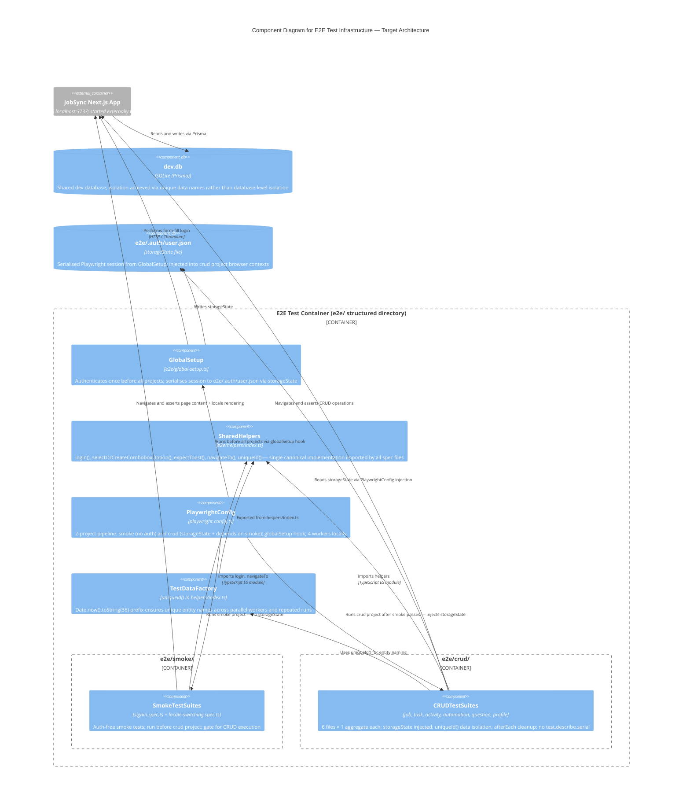

# C4 Component Level: E2E Test Infrastructure — Target (Post-Refactor) Architecture

## Overview

- **Name**: E2E Test Infrastructure (Target)
- **Description**: The redesigned Playwright end-to-end test suite with explicitly designed components: a single global authentication setup, a shared helper module, a two-project pipeline (smoke → crud), and self-contained CRUD tests per aggregate that create unique data and clean up after themselves.
- **Type**: Test Infrastructure (Playwright, TypeScript)
- **Technology**: Playwright 1.x, Chromium (system binary on NixOS), TypeScript, SQLite dev.db

---

## Purpose

The target architecture eliminates the structural defects identified in the current suite by introducing deliberate component boundaries. Authentication is performed once per suite run via a `globalSetup` hook that serialises session state to disk. All helper functions are extracted to a single shared module imported by every spec file. The flat `e2e/` directory is replaced with a `smoke/` and `crud/` hierarchy that maps directly to the two Playwright projects. Each CRUD test is made fully self-contained through the `uniqueId()` pattern and mandatory `afterEach` cleanup.

The result is a suite that runs in approximately 1–1.5 minutes instead of 6, can be parallelised safely with 4 workers, and has a single authoritative spec file per domain aggregate.

---

## Components

### Component 1 — `GlobalSetup`

**Source**: `e2e/global-setup.ts`

| Dimension | Detail |
|---|---|
| Hook type | Playwright `globalSetup` — runs once before all projects |
| Credentials | `admin@example.com` / `password123` |
| Output | `e2e/.auth/user.json` (Playwright `storageState` format) |
| Mechanism | Launches a browser page, performs form-fill login, waits for `/dashboard` redirect, calls `page.context().storageState({ path })` |
| Consumed by | `PlaywrightConfig` — passed as `storageState` to the `crud` project |
| Cost | One login per full suite run (~3–4 s total, not per test) |

`GlobalSetup` is the single source of truth for authentication state. Every CRUD test receives an already-authenticated browser context at no additional time cost. The `.auth/` directory is gitignored; the file is regenerated on every CI run.

---

### Component 2 — `SharedHelpers`

**Source**: `e2e/helpers/index.ts`

| Export | Signature | Description |
|---|---|---|
| `login` | `(page: Page) => Promise<void>` | Retained for smoke test use and standalone debugging; not called from `beforeEach` in CRUD files |
| `selectOrCreateComboboxOption` | `(page: Page, label: string, searchPlaceholder: string, text: string) => Promise<void>` | Canonical combobox interaction: label click → fill → exact match or create; single timeout constant (500 ms) |
| `expectToast` | `(page: Page, pattern: RegExp) => Promise<void>` | Toast assertion via `getByText(pattern).first()` with 10-second timeout |
| `navigateTo` | `(page: Page, path: string) => Promise<void>` | `page.goto(path)` + `waitForLoadState("networkidle")` |
| `uniqueId` | `() => string` | `Date.now().toString(36)` — millisecond-precision base-36 prefix for collision-free test data names |

`SharedHelpers` is the only place where these utilities are defined. All spec files import from `"../helpers"` (or `"../../helpers"` depending on nesting depth). Any fix, timeout adjustment, or new variant is made in one file and propagates automatically.

The single `selectOrCreateComboboxOption` implementation unifies the three timeout variants (300/500/600 ms) from the current suite into one well-tested constant. The three-step fallback strategy (exact → partial → create) from `profile-management.spec.ts` is adopted as the standard, since it is the most defensive.

---

### Component 3 — `PlaywrightConfig`

**Source**: `playwright.config.ts` (rewritten)

| Dimension | Current | Target |
|---|---|---|
| `globalSetup` | Not set | `"./e2e/global-setup.ts"` |
| Projects | 3 browsers (chromium/firefox/webkit) | 2 logical projects: `smoke` + `crud` |
| `smoke` project | — | No `storageState`; runs `e2e/smoke/` |
| `crud` project | — | `storageState: "e2e/.auth/user.json"`; `dependencies: ["smoke"]`; runs `e2e/crud/` |
| Workers | `undefined` (local) / `1` (CI) | `4` locally; `1` on CI |
| `fullyParallel` | `true` | `true` (now meaningful: 4 workers × isolated data) |

The `dependencies` array in the `crud` project declaration causes Playwright to run the `smoke` project first and gate `crud` execution on smoke passing. This provides an early-exit signal: if sign-in is broken, CRUD tests do not run and waste time producing misleading failures.

The three browser projects (firefox, webkit) are removed. They were never executed in practice; their presence created configuration noise. If cross-browser coverage is required in the future, it should be reintroduced with explicit CI budget allocation.

---

### Component 4 — `SmokeTestSuites`

**Source**: `e2e/smoke/signin.spec.ts`, `e2e/smoke/locale-switching.spec.ts`

| File | Tests | Auth | Notes |
|---|---|---|---|
| `signin.spec.ts` | 2 | None | Sign-in page rendering; sign-in + sign-out flow |
| `locale-switching.spec.ts` | 6 | None (except 1 test) | Locale cookie rendering for EN/DE/FR/ES; locale persistence after login |

Smoke tests run without `storageState`. They deliberately test the unauthenticated surface of the application and serve as the gate for the `crud` project. Both files are moved from `e2e/` into `e2e/smoke/` without functional change. Their auth-free nature is preserved by placing them in a project with no `storageState` configuration.

`locale-switching.spec.ts` retains its locale-aware `login()` variant (different signature: accepts translated label strings) because it tests the login form itself in each locale — this is not a case of duplicated authentication infrastructure but a deliberate test of localised UI strings.

---

### Component 5 — `CRUDTestSuites`

**Source**: `e2e/crud/` — 6 files, one per domain aggregate

| File | Aggregate | Legacy files retired | Tests (approx.) |
|---|---|---|---|
| `job.spec.ts` | Job | `add-job.spec.ts`, `job-crud.spec.ts` | 4 |
| `task.spec.ts` | Task | `tasks.spec.ts`, `task-crud.spec.ts` | 7 |
| `activity.spec.ts` | Activity | `activity-crud.spec.ts` | 3 |
| `automation.spec.ts` | Automation | `automation-crud.spec.ts` | 3 |
| `question.spec.ts` | Question | `question-crud.spec.ts` | 3 |
| `profile.spec.ts` | Profile/Resume | `profile.spec.ts`, `profile-management.spec.ts` | 6 |

Each file follows a fixed structural template:

```typescript
import { test, expect } from "@playwright/test";
import { selectOrCreateComboboxOption, expectToast, navigateTo, uniqueId } from "../helpers";

// storageState is injected by PlaywrightConfig — no login() call needed

test.afterEach(async ({ page }) => {
  // cleanup: delete any entity created in this test
});

test("should create …", async ({ page }) => {
  const title = `E2E Job ${uniqueId()}`;  // collision-free
  // …
});
```

Key structural rules enforced in each file:

1. **No `test.describe.serial`** — every test is independent; the `crud` project's `storageState` provides the shared precondition
2. **`afterEach` cleanup** — every test that creates a record deletes it in `afterEach`, even if the test body throws
3. **`uniqueId()` prefix** — every entity name is prefixed with a `Date.now().toString(36)` string, preventing collisions between tests running in parallel or across repeated runs
4. **Single import source** — all helpers come from `"../helpers"`, never re-implemented inline
5. **No `login()` in `beforeEach`** — authentication is provided by `storageState`; calling `login()` again would be redundant and would re-introduce the per-test overhead

The consolidation of legacy files follows the DDD principle of one spec per aggregate: `add-job.spec.ts` and `job-crud.spec.ts` merge into `job.spec.ts`; `tasks.spec.ts` and `task-crud.spec.ts` merge into `task.spec.ts`; `profile.spec.ts` and `profile-management.spec.ts` merge into `profile.spec.ts`. Task-activity integration tests and resume section tests (previously unique to the legacy files) are preserved in the consolidated files.

---

### Component 6 — `TestDataFactory`

**Source**: `uniqueId()` function in `e2e/helpers/index.ts`

| Dimension | Detail |
|---|---|
| Implementation | `Date.now().toString(36)` — e.g., `"lf3q2a"` |
| Usage | Prefix for all entity names created in CRUD tests |
| Example | `` `E2E Job ${uniqueId()}` `` → `"E2E Job lf3q2a"` |
| Collision window | Millisecond precision; functionally zero collision risk between parallel workers |
| Cleanup traceability | Prefixed names are identifiable in the database if manual cleanup is ever needed |

`TestDataFactory` is not a separate file but a conceptual component — the `uniqueId()` function exported from `SharedHelpers` that implements the test data isolation strategy. By ensuring every test creates uniquely named data, parallel execution with 4 workers is safe even against the shared `dev.db`.

The pattern deliberately avoids UUID generation (`crypto.randomUUID()`) in favour of base-36 timestamps. Timestamps are shorter (6–7 characters vs 36), human-readable enough to be identifiable in a database row, and monotonically increasing so that test data appears in insertion order during manual inspection.

---

## Execution Flow

```
1. playwright test
   │
   ├── globalSetup: e2e/global-setup.ts
   │   └── login once → write e2e/.auth/user.json
   │
   ├── Project: smoke (no storageState)
   │   ├── e2e/smoke/signin.spec.ts            [2 tests, parallel]
   │   └── e2e/smoke/locale-switching.spec.ts  [6 tests, parallel]
   │   └── [if any smoke test fails → abort; crud project does not run]
   │
   └── Project: crud (storageState: e2e/.auth/user.json, 4 workers)
       ├── e2e/crud/job.spec.ts          [4 tests]
       ├── e2e/crud/task.spec.ts         [7 tests]
       ├── e2e/crud/activity.spec.ts     [3 tests]
       ├── e2e/crud/automation.spec.ts   [3 tests]
       ├── e2e/crud/question.spec.ts     [3 tests]
       └── e2e/crud/profile.spec.ts      [6 tests]
           │
           each test:
           ├── beforeEach: (none — storageState already applied)
           ├── test body: create uniquely-named entity → assert
           └── afterEach: delete entity
```

**Runtime projection**:

| Phase | Current | Target |
|---|---|---|
| Auth overhead | ~2–3 min (42 × login) | ~4 s (1 × globalSetup login) |
| Smoke tests | ~45 s (serial within chrome project) | ~20 s (2 workers, parallel) |
| CRUD tests | ~3–4 min (serial or limited parallel) | ~60–90 s (4 workers, fully parallel) |
| Total | ~6.1 min | ~1–1.5 min |

---

## Interfaces Between Components

### `GlobalSetup` → `PlaywrightConfig`

- **Protocol**: File system
- **Contract**: `GlobalSetup` writes `e2e/.auth/user.json` in Playwright `storageState` JSON format. `PlaywrightConfig` references this path in the `crud` project's `use.storageState` property.
- **Failure mode**: If `globalSetup` throws (e.g., wrong credentials, app not running), Playwright aborts before any test runs.

### `SharedHelpers` → All spec files

- **Protocol**: TypeScript ES module import (`import { ... } from "../helpers"`)
- **Contract**: Named exports with stable signatures. Spec files depend on the exact signatures documented in Component 2. Breaking signature changes require updating all 6 CRUD files and the 2 smoke files.
- **Versioning**: No explicit versioning needed — all consumers are in the same repository; TypeScript compilation catches breaking changes at build time.

### `PlaywrightConfig` → Projects

- **Protocol**: Playwright configuration API (`defineConfig({ projects: [...] })`)
- **Contract**: `smoke` project has no `storageState` and no `dependencies`. `crud` project has `storageState: "e2e/.auth/user.json"` and `dependencies: ["smoke"]`. This contract ensures smoke tests gate CRUD tests and CRUD tests inherit authenticated session.

### `CRUDTestSuites` → `SharedHelpers`

- **Protocol**: TypeScript import
- **Operations consumed**:
  - `selectOrCreateComboboxOption(page, label, placeholder, text)` — used in job, activity, automation, profile tests
  - `expectToast(page, pattern)` — used in all 6 CRUD files
  - `navigateTo(page, path)` — used in all 6 CRUD files
  - `uniqueId()` — used in all 6 CRUD files for entity naming

### `CRUDTestSuites` → `GlobalSetup` (indirect)

- **Protocol**: `storageState` file injected by Playwright runtime
- **Contract**: Each CRUD test's `page` object arrives with the cookies and localStorage captured by `GlobalSetup`. Tests do not call `login()` and do not navigate to the sign-in page. If `user.json` is stale (e.g., server restarted with a different session secret), tests will fail at the first authenticated page load.

---

## Component Diagram

The diagram below shows the explicitly designed component structure within the **E2E Test Container** and the relationships between components, the application, and the shared database.



---

## Software Features by Component

### `GlobalSetup`

- Single pre-suite authentication execution
- Session serialisation to `e2e/.auth/user.json` via Playwright `storageState` API
- Dashboard URL verification before writing state
- Eliminates per-test login overhead (~3–4 s saved per test)

### `SharedHelpers`

- Canonical `login()` for smoke/standalone use (not `beforeEach` in CRUD files)
- Canonical `selectOrCreateComboboxOption()` with unified 500 ms timeout and three-step fallback
- `expectToast()` with 10-second visibility timeout
- `navigateTo()` with `networkidle` wait
- `uniqueId()` millisecond base-36 timestamp generator for collision-free test data

### `PlaywrightConfig`

- `globalSetup` hook registration
- Two-project pipeline with dependency ordering (smoke → crud)
- `storageState` injection for the `crud` project
- 4-worker parallel execution locally
- Single browser (Chromium) — firefox/webkit projects removed

### `SmokeTestSuites`

- Sign-in page title and heading verification (auth-free)
- Sign-in and sign-out flow
- Locale rendering validation for EN, DE, FR, ES via NEXT_LOCALE cookie
- HTML `lang` attribute assertion per locale
- Locale persistence after login (DE test)
- Invalid locale fallback to English
- Serves as execution gate: failure aborts the crud project

### `CRUDTestSuites`

- Job aggregate: create (unique title/company/location), edit description, delete; consolidated from `add-job.spec.ts` + `job-crud.spec.ts`
- Task aggregate: create, edit, change status, delete; task-activity integration (start, linked-block, completed-block); consolidated from `tasks.spec.ts` + `task-crud.spec.ts`
- Activity aggregate: create with name/type/time, delete; afterEach guaranteed cleanup
- Automation aggregate: 6-step EURES wizard (keywords, location, resume, threshold, schedule), verify, delete
- Question aggregate: create with skill tag, edit, delete; afterEach guaranteed cleanup
- Profile/Resume aggregate: create resume, add summary/experience/education/contact sections, edit title, delete; consolidated from `profile.spec.ts` + `profile-management.spec.ts`

### `TestDataFactory`

- Millisecond-precision base-36 timestamp generation
- Unique entity name prefixes for all CRUD test data
- Collision-free across 4 parallel workers
- Human-readable identifiers for manual database inspection

---

## Key Improvements Over Current Architecture

| Dimension | Current | Target | Gain |
|---|---|---|---|
| Total test count | ~42 | ~37 | 5 legacy-duplicate tests retired |
| Suite runtime | ~6.1 min | ~1–1.5 min | ~4–5× faster |
| Login executions | 42 (per test) | 1 (globalSetup) | ~2–3 min saved |
| Helper implementations | 9 × login, 5 × combobox, 2 × toast | 1 × each | Single fix point |
| Spec files per aggregate | 2 (job, task, profile) | 1 | Clear aggregate ownership |
| `test.describe.serial` | 3 files | 0 | No cascading failures |
| `afterEach` cleanup | Inline only (breaks on failure) | Guaranteed in all CRUD tests | No orphaned data |
| Parallel safety | None (shared data names) | `uniqueId()` prefix | 4 workers safe |
| Smoke gate | None | `dependencies: ["smoke"]` | Fail-fast on auth breakage |
