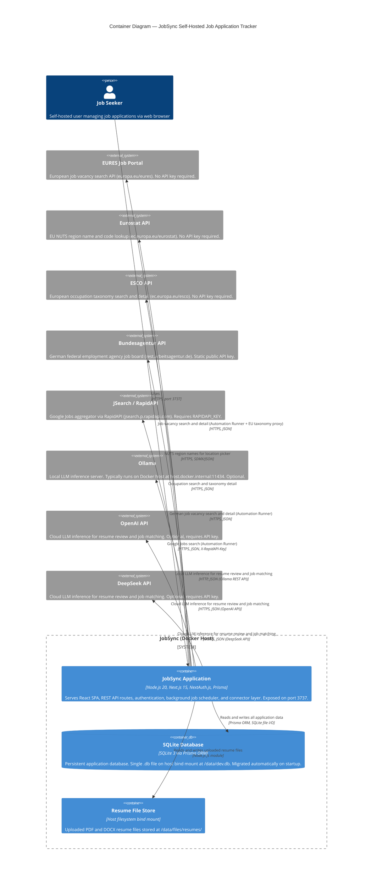

# C4 Container Level: JobSync System Deployment

## Overview

JobSync is a **single-container self-hosted application**. The entire system — React frontend, Next.js server, API routes, background scheduler, and connector layer — runs as one Node.js process inside a Docker container. The SQLite database is a file co-located on the same host volume. All external dependencies (job boards, AI providers, EU taxonomy APIs) are third-party HTTPS services that the container calls outbound.

This deployment model is intentional: JobSync is designed to be operated by individuals on personal infrastructure (home servers, VPS instances, NAS boxes) with zero external service dependencies beyond optional AI providers.

---

## Containers

### 1. JobSync Application Container

- **Name**: JobSync Application
- **Description**: Unified Next.js 15 application serving the React SPA, all REST API routes, NextAuth authentication, background cron scheduler, and the connector layer. Deployed as a single Docker container from the official `ghcr.io/gsync/jobsync` image.
- **Type**: Web Application (fullstack monolith)
- **Technology**: Node.js 20, Next.js 15 (App Router, standalone output), NextAuth.js v5, Prisma ORM 6, Shadcn UI, TypeScript
- **Deployment**: Docker container, port 3737, managed via `docker-compose.yml` or standalone `docker run`
- **Image**: `ghcr.io/gsync/jobsync:latest`

#### Purpose

The container starts via `docker-entrypoint.sh`, which runs Prisma migrations against the mounted SQLite volume and then launches the Next.js standalone server (`node server.js`) as the `nextjs` system user. A `node-cron` task embedded in the process polls for due automations every hour (`CRON_EXPRESSION: "0 * * * *"`).

The container handles four distinct runtime responsibilities:

1. **Frontend rendering** — Server-side rendered React pages under `/dashboard/*` and static pages under `/` and `/(auth)/*`
2. **API layer** — REST routes under `/api/*` covering authentication, job data, automations, AI inference, EU taxonomy proxying, and file I/O
3. **Background scheduler** — In-process `node-cron` job that wakes up hourly, queries for active automations whose `nextRunAt` has passed, and executes the full connector-to-AI-to-database pipeline
4. **Connector layer** — Anti-Corruption Layer (`src/lib/connector/job-discovery/`) that translates EURES, Bundesagentur, and JSearch API responses into the canonical `DiscoveredVacancy` domain type

#### Components

This container deploys the following logical components:

- **Next.js App Router** (`src/app/`) — Pages, layouts, and route groups (`(auth)`, `dashboard`)
- **API Routes** (`src/app/api/`) — All REST endpoints; see Interfaces section
- **Server Actions / Repository Layer** (`src/actions/`) — Typed `ActionResult<T>`-returning database operations for all aggregates (Job, Automation, Profile, Task, Activity, etc.)
- **Authentication** (`src/auth.ts`, `src/middleware.ts`) — NextAuth.js session management; middleware protects `/dashboard` and `/dashboard/**`
- **Connector Registry** (`src/lib/connector/job-discovery/registry.ts`) — Factory registry mapping connector IDs to `DataSourceConnector` implementations
- **EURES Connector** (`src/lib/connector/job-discovery/modules/eures/`) — Calls `https://europa.eu/eures/api`; implements circuit breaker and bulkhead resilience patterns
- **Bundesagentur Connector** (`src/lib/connector/job-discovery/modules/arbeitsagentur/`) — Calls `https://rest.arbeitsagentur.de`; uses public API key `jobboerse-jobsuche`
- **JSearch Connector** (`src/lib/connector/job-discovery/modules/jsearch/`) — Calls `https://jsearch.p.rapidapi.com`; requires `RAPIDAPI_KEY`
- **Automation Runner** (`src/lib/connector/job-discovery/runner.ts`) — Orchestrates the search → deduplication → AI matching → persistence pipeline
- **Background Scheduler** (`src/lib/scheduler/index.ts`) — `node-cron` wrapper polling SQLite for `status=active, nextRunAt<=now`
- **AI Provider Layer** (`src/lib/connector/ai-provider/`) — Vercel AI SDK integration supporting Ollama (local), OpenAI, and DeepSeek
- **Encryption Module** (`src/lib/encryption.ts`) — AES-256-GCM key derivation with PBKDF2 for API key storage
- **i18n System** (`src/i18n/`) — Dictionary-based internationalization for EN, DE, FR, ES

#### Interfaces

##### Authentication API

- **Protocol**: REST over HTTPS
- **Description**: NextAuth.js credentials-based login and session management
- **Base path**: `/api/auth/`

| Method | Endpoint | Description |
|--------|----------|-------------|
| POST | `/api/auth/signin` | Credential sign-in (email + password) |
| GET/POST | `/api/auth/[...nextauth]` | NextAuth.js catch-all handler (session, CSRF, signout) |

##### Automation Execution API

- **Protocol**: REST + Server-Sent Events over HTTPS
- **Description**: Trigger manual automation runs and stream real-time execution logs

| Method | Endpoint | Description |
|--------|----------|-------------|
| POST | `/api/automations/{id}/run` | Trigger a manual automation run (rate-limited: 5/hour per user) |
| GET | `/api/automations/{id}/logs` | SSE stream of live run log entries |
| DELETE | `/api/automations/{id}/logs/clear` | Clear in-memory log store for an automation |

##### AI Inference API

- **Protocol**: REST over HTTPS (streaming responses for review endpoint)
- **Description**: Resume review and job-match scoring via configurable AI backends

| Method | Endpoint | Description |
|--------|----------|-------------|
| POST | `/api/ai/resume/review` | Stream a structured resume review analysis (rate-limited: 5/min per user) |
| POST | `/api/ai/resume/match` | Score a resume against a job description |
| GET | `/api/ai/ollama/tags` | Proxy: list available models from the configured Ollama instance |
| GET | `/api/ai/ollama/ps` | Proxy: list running Ollama processes |
| POST | `/api/ai/ollama/generate` | Proxy: raw Ollama generate endpoint |
| GET | `/api/ai/deepseek/models` | Proxy: list available DeepSeek models |

##### EU Taxonomy Proxy API

- **Protocol**: REST over HTTPS (requires active session; prevents unauthenticated EURES/ESCO access)
- **Description**: Authenticated proxy routes for EURES location data and ESCO occupation search; responses are Next.js-cached (revalidation: 1 hour for locations, 5 minutes for ESCO)

| Method | Endpoint | Description |
|--------|----------|-------------|
| GET | `/api/eures/locations` | Country → NUTS1 → NUTS2/3 location hierarchy with job counts (merges EURES stats with Eurostat NUTS names) |
| GET | `/api/eures/occupations` | EURES occupation category list |
| GET | `/api/esco/search?text=&language=&limit=` | ESCO occupation search (max 20 results) |
| GET | `/api/esco/details` | ESCO occupation detail with ISCO groups and skill links |

##### Job Data API

- **Protocol**: REST over HTTPS
- **Description**: Job record management and data export

| Method | Endpoint | Description |
|--------|----------|-------------|
| POST | `/api/jobs/export` | Streaming CSV export of all user jobs |

##### Profile and File API

- **Protocol**: REST / multipart over HTTPS
- **Description**: Resume profile management and PDF/DOCX file upload and download

| Method | Endpoint | Description |
|--------|----------|-------------|
| POST | `/api/profile/resume` | Create or update resume (accepts multipart with optional file upload) |
| GET | `/api/profile/resume?filePath=` | Download an uploaded resume file (PDF or DOCX) |

##### Settings API

- **Protocol**: REST over HTTPS
- **Description**: API key validation against live provider endpoints

| Method | Endpoint | Description |
|--------|----------|-------------|
| POST | `/api/settings/api-keys/verify` | Verify an API key for `openai`, `deepseek`, `rapidapi`, or `ollama` |

#### Dependencies

##### Volumes (Host-Mounted)

- **SQLite Database file**: `./jobsyncdb/data/dev.db` mounted at `/data/dev.db` — primary application database (see SQLite Volume below)
- **Resume file storage**: `./jobsyncdb/data/files/resumes/` mounted at `/data/files/resumes/` — uploaded PDF and DOCX resume files

##### External HTTPS Services Called Outbound

All outbound calls are made from server-side code only (API routes, server actions, scheduler). The browser never calls these services directly.

| Service | Base URL | Used For | Auth |
|---------|----------|----------|------|
| EURES Job Search | `https://europa.eu/eures/api` | Automation job search and vacancy details | None (public API) |
| Eurostat NUTS API | `https://ec.europa.eu/eurostat/api` | NUTS region names for location picker | None (public API) |
| ESCO API | `https://ec.europa.eu/esco/api` | Occupation search and taxonomy details | None (public API) |
| Bundesagentur API | `https://rest.arbeitsagentur.de` | German job board search and details | Static API key `jobboerse-jobsuche` |
| JSearch / RapidAPI | `https://jsearch.p.rapidapi.com` | Google Jobs aggregator search | `RAPIDAPI_KEY` env var |
| OpenAI API | `https://api.openai.com` | Resume review and job matching (optional) | `OPENAI_API_KEY` env var or per-user encrypted key |
| DeepSeek API | `https://api.deepseek.com` | Resume review and job matching (optional) | `DEEPSEEK_API_KEY` env var or per-user encrypted key |
| Ollama | Configurable (default: `http://host.docker.internal:11434`) | Local LLM inference for resume review and job matching (optional) | None (local service) |

#### Infrastructure

- **Deployment Config**: [`Dockerfile`](../../Dockerfile), [`docker-compose.yml`](../../docker-compose.yml), [`docker-entrypoint.sh`](../../docker-entrypoint.sh)
- **Port**: 3737 (configurable via `PORT` env var)
- **Startup sequence**: `docker-entrypoint.sh` → Prisma `migrate deploy` → `su nextjs node server.js`
- **Health check**: `wget --spider -q http://localhost:3737` every 30s, 3 retries, 30s start period
- **Scaling**: Single-instance design. SQLite and in-process scheduler preclude horizontal scaling. Vertical scaling (CPU/RAM) applies.
- **Resources**: Typical idle: ~100–200 MB RAM. Under AI workload: depends on Ollama model size (Ollama runs externally). Recommend 512 MB RAM minimum for the container itself.
- **Security**: Runs as unprivileged `nextjs:nodejs` user (uid 1001). Root is used only in `docker-entrypoint.sh` for Prisma migrations and `chown /data`. API keys stored encrypted with AES-256-GCM + PBKDF2.

#### Key Environment Variables

| Variable | Required | Description |
|----------|----------|-------------|
| `DATABASE_URL` | Yes | SQLite file path, e.g. `file:/data/dev.db` |
| `AUTH_SECRET` | Yes | NextAuth signing secret (auto-generated if absent) |
| `ENCRYPTION_KEY` | Yes | AES-256 key derivation secret for stored API keys |
| `NEXTAUTH_URL` | Yes | Public base URL of the application |
| `OLLAMA_BASE_URL` | No | Ollama server URL (default: `http://host.docker.internal:11434`) |
| `OPENAI_API_KEY` | No | Global OpenAI key (users can also provide per-account keys) |
| `DEEPSEEK_API_KEY` | No | Global DeepSeek key (users can also provide per-account keys) |
| `RAPIDAPI_KEY` | No | RapidAPI key for JSearch connector |
| `TZ` | No | Timezone for scheduler cron expressions (default: UTC) |

---

### 2. SQLite Volume

- **Name**: SQLite Database Volume
- **Description**: A single SQLite database file (`dev.db`) stored on the Docker host filesystem via a named bind mount. Prisma ORM manages the schema; migrations run automatically on container startup via `prisma migrate deploy`.
- **Type**: Embedded Database (file-based)
- **Technology**: SQLite 3 via Prisma ORM 6 (prisma-client-js)
- **Deployment**: Host bind mount `./jobsyncdb/data:/data`

#### Purpose

The SQLite volume is the sole persistence layer for the entire JobSync system. It is not a separate running process — it is a file accessed directly via the Node.js process through the `libsql` driver embedded in Prisma. Because it resides on a host bind mount (not inside the container image), it survives container restarts and image upgrades.

#### Schema Summary

The schema (`prisma/schema.prisma`) defines the following aggregate roots and their associated tables:

| Aggregate | Core Tables | Notes |
|-----------|-------------|-------|
| User | `User`, `UserSettings`, `ApiKey` | API keys stored AES-256-GCM encrypted |
| Job | `Job`, `JobStatus`, `JobTitle`, `Company`, `Location`, `JobSource`, `Note`, `Tag`, `Interview`, `Contact` | `Job` carries automation discovery fields (`automationId`, `matchScore`, `matchData`) |
| Automation | `Automation`, `AutomationRun` | `AutomationRun` tracks per-run metrics and lifecycle status |
| Profile | `Profile`, `Resume`, `ResumeSection`, `ContactInfo`, `Summary`, `WorkExperience`, `Education`, `LicenseOrCertification`, `OtherSection`, `File` | Resume files stored separately on the file volume |
| Activity | `Activity`, `ActivityType`, `Task` | Time-tracking for job application activities |
| Question | `Question`, `Tag` | Interview question bank |

#### Dependencies

None. The SQLite file is read/written directly by the JobSync Application Container via Prisma's file-system driver.

#### Infrastructure

- **Location**: `./jobsyncdb/data/dev.db` on Docker host
- **Migration management**: Prisma Migrate — `prisma migrate deploy` runs automatically on each container start
- **Backup**: No built-in backup. The entire state lives in one `.db` file; host-level backup (cron copy, volume snapshot) is the recommended strategy.

---

## Container Diagram

---

## Inter-Container Communication Summary

| From | To | Protocol | Description |
|------|----|----------|-------------|
| Browser | JobSync Application | HTTPS (port 3737) | All page navigation, API calls, SSE streams |
| JobSync Application | SQLite Volume | Prisma / SQLite file I/O | All database reads and writes; direct file access, no network hop |
| JobSync Application | Resume File Store | Node.js `fs` | Resume file upload writes; resume download reads |
| JobSync Application | EURES API | HTTPS POST/GET | Automation vacancy search and detail enrichment; also proxied via `/api/eures/*` for the location picker |
| JobSync Application | Eurostat API | HTTPS GET | NUTS code-to-name lookup, cached 24h by Next.js |
| JobSync Application | ESCO API | HTTPS GET | Occupation search, cached 5 min by Next.js |
| JobSync Application | Bundesagentur API | HTTPS GET | Automation vacancy search and detail enrichment |
| JobSync Application | JSearch / RapidAPI | HTTPS GET | Automation vacancy search (Google Jobs) |
| JobSync Application | Ollama | HTTP GET/POST | LLM inference for resume review and automation job matching |
| JobSync Application | OpenAI API | HTTPS POST | Cloud LLM inference for resume review and automation job matching |
| JobSync Application | DeepSeek API | HTTPS POST | Cloud LLM inference for resume review and automation job matching |

---

## Deployment Notes

### Single-Container Architecture Rationale

JobSync collapses all server-side concerns into one container because:

1. **Self-hosted target audience** — Users run this on personal hardware where container orchestration overhead is undesirable.
2. **SQLite constraint** — SQLite cannot be accessed concurrently by multiple processes over a network; co-location is required.
3. **In-process scheduler** — `node-cron` runs inside the Node.js process. A separate scheduler container would require a coordination mechanism (advisory locks, a task queue) not present in the current design.
4. **Zero-dependency philosophy** — No Redis, no RabbitMQ, no separate auth server. The entire application state fits in one SQLite file.

### Upgrade Strategy

Container upgrades are non-destructive because data lives on the host bind mount (`./jobsyncdb/data/`), not inside the container image. The `docker-entrypoint.sh` startup script runs `prisma migrate deploy` before starting the server, so schema migrations apply automatically on `docker pull` + `docker-compose up`.

### Ollama Integration

Ollama is the only optional dependency with a network topology consideration. In Docker Compose, `host.docker.internal` resolves to the Docker host gateway (configured via `extra_hosts`), allowing the container to reach an Ollama process running directly on the host. Users on Linux without Docker Desktop must ensure `host.docker.internal:host-gateway` is set, which the provided `docker-compose.yml` configures by default.

### AI Provider Selection

Users configure their preferred AI provider and model in `/dashboard/settings`. The provider choice (Ollama, OpenAI, or DeepSeek) is stored in `UserSettings.settings` as JSON. The `runner.ts` automation runner and the `/api/ai/resume/*` endpoints read this setting per-user, enabling each user to independently configure their AI backend. Per-user API keys are stored encrypted in the `ApiKey` table using AES-256-GCM with PBKDF2 key derivation.
