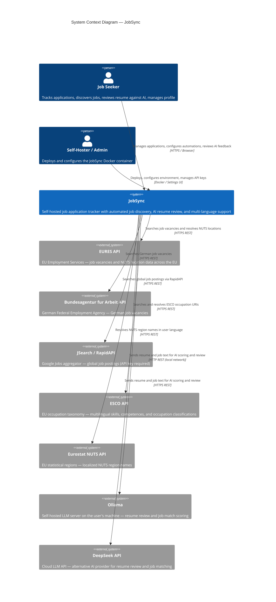

# C4 Context Level: JobSync System Context

## System Overview

### Short Description

JobSync is a self-hosted, open-source job application tracking platform that helps job seekers discover, evaluate, and manage job applications through their full lifecycle using automated job board connectors and AI-powered resume matching.

### Long Description

JobSync runs entirely on the user's own infrastructure via Docker, ensuring that all personal and professional data remains under the user's control. The system combines three capabilities: a manual job application tracker (CRUD with status workflow), an automated job discovery engine (scheduled connectors to EU and German job boards), and an AI layer that scores discovered jobs against the user's resume before surfacing them.

Users interact with a Next.js web application. Behind the scenes, a scheduler triggers automations that call external job board APIs through an Anti-Corruption Layer (Connector/Module pattern). Discovered vacancies are scored by a local Ollama LLM or the DeepSeek cloud API, and only those above the user-configured match threshold are saved to the SQLite database. Authentication is handled by NextAuth with credential-based login; the system does not currently require OAuth providers for its core workflow.

Reference and taxonomy data (ESCO occupations, EURES locations, Eurostat NUTS regions) are fetched on-demand through server-side API proxy routes that enforce session authentication to prevent unauthenticated use of the EU public APIs. All API keys stored by the user (DeepSeek, RapidAPI) are encrypted at rest with AES.

---

## Personas

### Job Seeker

- **Type**: Human User
- **Description**: A person actively or passively searching for employment who uses JobSync to organize their search. May be a professional in any field, from any EU or German-speaking country. The primary and only interactive user of the system in normal operation.
- **Goals**:
  - Track submitted applications and their current status (draft, applied, interview, offer, rejected, etc.)
  - Discover new job openings automatically without visiting multiple job boards manually
  - Understand how well their resume matches a given vacancy before spending time applying
  - Keep resume and professional profile up to date in one place
  - Log activities, tasks, and notes related to each application
  - Ask interview preparation questions and record answers
- **Key Features Used**: Job Application Tracker, Automated Job Discovery (Automations), AI Resume Review, AI Job Match, Profile and Resume Management, Activity and Task Tracking, Q&A Bank, Dashboard Analytics, Settings (AI provider, language, API keys)

### Self-Hoster / Administrator

- **Type**: Human User (often the same person as the Job Seeker in single-user deployments)
- **Description**: The person responsible for deploying and operating the JobSync Docker container. In most deployments this is the same individual as the job seeker. In household or small-team deployments it may be a technically capable person running the instance for others.
- **Goals**:
  - Deploy and keep the application running with minimal operational overhead
  - Configure environment variables (AUTH_SECRET, ENCRYPTION_KEY, OLLAMA_BASE_URL, API keys)
  - Update to new versions via the deploy script
  - Configure timezone, base URL, and optional API keys for external services
  - Ensure data persists across container restarts via the volume mount
- **Key Features Used**: Docker Compose deployment, Environment variable configuration, Developer Settings (debug logging), Settings UI (API key management)

### Automation Scheduler

- **Type**: Programmatic User (internal)
- **Description**: The built-in Next.js server-side scheduler (`src/lib/scheduler/`) that triggers automation runs on a configured hourly schedule. It has no human interface; it runs as a background process within the application server.
- **Goals**:
  - Execute each active Automation at its configured `scheduleHour`
  - Invoke the Connector/Module pipeline to fetch discovered vacancies
  - Hand off to the AI matching engine and persist matched jobs
  - Record run metadata (jobs searched, matched, saved, errors) in `AutomationRun`
- **Key Features Used**: Connector Registry, Automation Runner, AI Match Engine, SQLite persistence

---

## System Features

### Job Application Tracker

- **Description**: Full CRUD management of job applications. Each job record stores title, company, location, status, source, description, salary range, due date, applied date, resume used, tags, and notes. Status progresses through a configurable workflow (Draft, Applied, Interview, Offer, Rejected, etc.). Users can manually add jobs or accept auto-discovered ones.
- **Users**: Job Seeker
- **User Journey**: [Manual Job Application Journey](#manual-job-application-journey)

### Automated Job Discovery (Automations)

- **Description**: Users create named Automations specifying a job board connector, keywords, location, resume, match threshold, and schedule. The scheduler runs each automation at its configured hour. The Connector queries the job board, deduplicates against existing jobs, enriches with detail data where available, scores each vacancy against the resume using AI, and saves matches above the threshold.
- **Users**: Job Seeker (configuration), Automation Scheduler (execution)
- **User Journey**: [Automated Job Discovery Journey](#automated-job-discovery-journey)

### AI Resume Review

- **Description**: Users submit their stored resume to an AI provider (Ollama or DeepSeek) and receive structured feedback on content, language, and presentation. Uses the Vercel AI SDK to stream the response.
- **Users**: Job Seeker
- **User Journey**: [AI Resume Review Journey](#ai-resume-review-journey)

### AI Job Match

- **Description**: Users can manually trigger a job-vs-resume match for any job in their tracker. The AI returns a percentage match score with reasoning, the same scoring used automatically in the Automation pipeline.
- **Users**: Job Seeker
- **User Journey**: [AI Job Match Journey](#ai-job-match-journey)

### Profile and Resume Management

- **Description**: Users build structured resumes inside JobSync: contact information, summary, work experience, education, licenses/certifications, and free-form sections. Resumes are used both for display and as input to AI features. Resume files (PDFs) can also be uploaded and attached to a resume record.
- **Users**: Job Seeker
- **User Journey**: [Resume Management Journey](#resume-management-journey)

### Activity and Task Tracking

- **Description**: Users log activities linked to job applications (phone calls, emails, interviews) with start/end times and duration. Tasks represent discrete work items with status, priority, completion percentage, and due dates. Activities can be linked to tasks for time-tracking purposes.
- **Users**: Job Seeker

### Q&A Bank (Interview Preparation)

- **Description**: Users store interview questions and their prepared answers, tagged for retrieval by role or topic. Serves as a personal knowledge base for interview preparation.
- **Users**: Job Seeker

### Monitoring Dashboard

- **Description**: The landing page after login. Shows aggregated statistics about the job search: applications by status, recent activity, upcoming tasks, automation run history, and key metrics.
- **Users**: Job Seeker

### Multi-Language UI

- **Description**: The full application UI is available in English, German, French, and Spanish. Language is set per user in settings and stored in a `NEXT_LOCALE` cookie. EU API calls (EURES, ESCO, Eurostat NUTS) use the user's locale to return localized data.
- **Users**: Job Seeker

### Developer Settings

- **Description**: A settings panel for advanced users to configure debug logging behavior. Server-side debug logging is controlled by the `DEBUG_LOGGING` environment variable; the UI panel stores developer preferences in `UserSettings`.
- **Users**: Self-Hoster / Administrator

### Settings and API Key Management

- **Description**: Users configure AI provider (Ollama URL, DeepSeek API key, model selection), manage API keys for external services (RapidAPI/JSearch), and set UI preferences (language, timezone). API keys are AES-encrypted before storage.
- **Users**: Job Seeker, Self-Hoster / Administrator

---

## User Journeys

### Manual Job Application Journey

**Persona**: Job Seeker

1. **Authenticate**: Job Seeker navigates to `http://localhost:3737`, enters email and password, and is redirected to the dashboard.
2. **Navigate to job list**: Clicks "New Job" button or navigates to My Jobs.
3. **Create job record**: Fills in job URL, title (create-or-search), company, location, job type, source, and description; sets initial status to Draft.
4. **Save and track**: Job is saved to SQLite. The job seeker can now update the status as the application progresses.
5. **Add notes**: Adds free-text notes to the job record (interview feedback, follow-up reminders, contact details).
6. **Update status**: Moves the job through status stages (Applied, Interview, Offer, etc.) as events occur.
7. **Log activity**: Records a phone screen or interview as an Activity linked to the job.
8. **Add task**: Creates a follow-up task with a due date.

### Automated Job Discovery Journey

**Persona**: Job Seeker (setup), Automation Scheduler (execution)

**Setup (Job Seeker):**

1. **Configure AI provider**: In Settings, enters Ollama URL or DeepSeek API key and selects a model.
2. **Build resume**: Creates a resume in Profile with contact info, work experience, and education sections.
3. **Create Automation**: Navigates to Automations, clicks "Create Automation", selects a job board connector (EURES, Arbeitsagentur, or JSearch), enters keywords and location, selects resume, sets match threshold (e.g., 80%), and sets the schedule hour.
4. **Activate**: Saves the Automation; it is set to status "active" with `nextRunAt` computed.

**Execution (Automation Scheduler):**

5. **Scheduler triggers**: At the configured `scheduleHour`, the scheduler selects all active Automations due for execution.
6. **Job board search**: The Connector Module for the configured job board (EURES, Arbeitsagentur, or JSearch) is instantiated from the registry and `search()` is called with keywords, location, and connector-specific parameters.
7. **External API call**: The Module calls the external job board API (EURES API, Bundesagentur API, or RapidAPI/JSearch). Results are returned as `ConnectorResult<DiscoveredVacancy[]>`.
8. **Deduplication**: The runner filters out vacancies whose normalized URL already exists in the user's job list.
9. **Detail enrichment**: For EURES jobs, the Module calls the EURES details endpoint per vacancy to fetch full description and application instructions.
10. **AI scoring**: Each new vacancy is scored against the user's resume by the AI provider (Ollama or DeepSeek), returning a `matchScore` percentage.
11. **Threshold filter**: Vacancies scoring below the automation's `matchThreshold` are discarded.
12. **Persist**: Matched vacancies are saved as Job records with `discoveryStatus`, `matchScore`, and `automationId` set.
13. **Run record**: An `AutomationRun` record is created with counters (searched, deduplicated, processed, matched, saved) and final status.

**Review (Job Seeker):**

14. **Dashboard notification**: The job seeker sees newly discovered jobs in My Jobs with match scores.
15. **Review and act**: Reviews each discovered job, updates status to "Applied" if they decide to apply, or archives if not relevant.

### AI Resume Review Journey

**Persona**: Job Seeker

1. **Navigate to AI section**: Goes to the AI Resume Review page.
2. **Select resume**: Picks a stored resume from their profile.
3. **Submit for review**: Sends request to `/api/ai/ollama/review` or `/api/ai/deepseek` based on configured provider.
4. **AI processes**: JobSync sends the resume text to Ollama (local) or DeepSeek (cloud API).
5. **Receive feedback**: Streamed review response is displayed covering clarity, formatting, content gaps, and improvement suggestions.
6. **Iterate**: Job Seeker edits the resume in Profile and can re-submit for another review.

### AI Job Match Journey

**Persona**: Job Seeker

1. **Open job record**: Navigates to a job in My Jobs and opens its detail view.
2. **Select resume**: Chooses which resume to match against the job description.
3. **Trigger match**: Clicks "Match" to call `/api/ai/ollama/match` or `/api/ai/deepseek`.
4. **AI scores**: The AI receives resume text and job description, returns a structured match score (0-100) with per-section reasoning (skills match, experience match, education match).
5. **View result**: Match score and reasoning are displayed on the job detail page; score is persisted to the job record.

### Resume Management Journey

**Persona**: Job Seeker

1. **Navigate to Profile**: Clicks "Profile" in the sidebar.
2. **Create resume**: Clicks "New Resume", enters a title (e.g., "Full Stack Developer").
3. **Add contact info**: Via "Add Section" > "Add Contact Info" — first name, last name, headline, email, phone, address.
4. **Add summary**: Via "Add Section" > "Add Summary" — rich text summary of professional background.
5. **Add work experience**: Via "Add Section" > "Add Experience" — job title, company, location, dates, description.
6. **Add education**: Via "Add Section" > "Add Education" — institution, degree, field of study, dates, description.
7. **Upload PDF (optional)**: Attaches an existing PDF resume file to the record for AI review features.
8. **Use in Automation**: Selects the resume when creating an Automation so the runner has content to match against.

### External System: ESCO Occupation Search Journey

**Persona**: Automation Scheduler / Job Seeker (via Automation Wizard)

1. **User types occupation keyword**: In the ESCO occupation combobox within the Automation Wizard.
2. **Client calls proxy**: Frontend calls `/api/esco/search?query=...`.
3. **Server-side proxy**: The API route validates the session (auth guard), reads the user's locale from `NEXT_LOCALE` cookie, and calls `https://ec.europa.eu/esco/api/search`.
4. **ESCO returns**: Returns a list of occupation URIs, labels, and ISCO group information in the user's language.
5. **Display**: The combobox shows results with occupation labels; selecting one stores the ESCO URI as a connector parameter.

### External System: EURES Location Search Journey

**Persona**: Job Seeker (via Automation Wizard)

1. **User selects country and region**: Uses the EURES location combobox (three-level: Country > NUTS Region > City).
2. **Client calls proxy**: Frontend calls `/api/eures/locations?...`.
3. **Server-side proxy**: Auth guard, locale-aware, forwards to `https://ec.europa.eu/eures/eures-searchengine/page/jobsearch/`.
4. **EURES returns**: Returns NUTS location codes with names in the user's language.
5. **Automation stores code**: The selected NUTS code is stored as a `connectorParam` on the Automation.

---

## External Systems and Dependencies

### EURES API (EU Employment Services)

- **Type**: Public REST API
- **Description**: The European Employment Services API provided by the European Commission. Provides access to job vacancies across EU member states and multilingual location data via NUTS codes.
- **Integration Type**: HTTPS REST — server-side only, proxied through `/api/eures/*` routes
- **Purpose**: Primary EU-wide job board connector; also supplies the location picker data (NUTS hierarchy with flags) used in the Automation Wizard
- **Trust Boundary**: Public EU API. Accessed only from the server; never directly from the browser. All proxy routes require an authenticated session. No API key required.
- **Relevant ADRs**: ADR-004 (ACL pattern)

### Bundesagentur fur Arbeit API (German Federal Employment Agency)

- **Type**: Public REST API
- **Description**: The job search API of the German Federal Employment Agency (`jobsuche.api.bund.dev`). Provides German job vacancies with rich metadata including coordinates, salary ranges, and employer details.
- **Integration Type**: HTTPS REST — server-side Connector Module
- **Purpose**: German job market connector for users searching in the DACH region
- **Trust Boundary**: Public German government API. No API key required. Accessed only during Automation runs from the server.
- **Relevant ADRs**: ADR-004 (ACL pattern)

### JSearch / RapidAPI (Google Jobs Data)

- **Type**: Commercial REST API
- **Description**: The JSearch API on RapidAPI aggregates Google Jobs data, providing broad coverage of global job postings. Requires a RapidAPI subscription key.
- **Integration Type**: HTTPS REST — server-side Connector Module; API key stored AES-encrypted in `ApiKey` table
- **Purpose**: Global job discovery connector, particularly useful for English-language markets and roles not covered by EU-specific boards
- **Trust Boundary**: Commercial third-party API. API key required and stored encrypted. Accessed only during Automation runs.
- **Relevant ADRs**: ADR-004 (ACL pattern)

### ESCO API (European Skills, Competences, Qualifications and Occupations)

- **Type**: Public REST API
- **Description**: The EU ESCO API (`ec.europa.eu/esco/api`) provides a multilingual taxonomy of occupations, skills, and qualifications aligned with the ISCO-08 standard.
- **Integration Type**: HTTPS REST — server-side proxy via `/api/esco/*` routes
- **Purpose**: Powers the occupation combobox in the Automation Wizard; URI-based occupation identifiers are stored as connector parameters
- **Trust Boundary**: Public EU API. All proxy routes enforce session authentication (ADR security rule) and validate that URIs start with `http://data.europa.eu/esco/` to prevent SSRF. Never called directly from the browser.
- **Relevant ADRs**: ADR-009 (SSRF prevention pattern)

### Eurostat NUTS API

- **Type**: Public REST API
- **Description**: The Eurostat API provides NUTS (Nomenclature of Territorial Units for Statistics) region names in multiple EU languages. Used to resolve NUTS codes to human-readable region names.
- **Integration Type**: HTTPS REST — called server-side when resolving region labels for the EURES location hierarchy
- **Purpose**: Provides localized NUTS region names for the EURES location picker
- **Trust Boundary**: Public EU API. Session-authenticated proxy. No API key required.

### Ollama (Self-Hosted LLM)

- **Type**: Local HTTP Service
- **Description**: Ollama is a self-hosted large language model server. JobSync communicates with it via HTTP at a configurable URL (default: `http://host.docker.internal:11434`). Users configure the Ollama URL and select from available models (tested with llama3.2, qwen 8B variants).
- **Integration Type**: HTTP REST — the JobSync Docker container calls Ollama on the host machine via `host.docker.internal`
- **Purpose**: Provides AI capabilities (resume review, job match scoring) without sending data to cloud services. The default and privacy-preferred AI provider.
- **Trust Boundary**: User's own infrastructure. The Ollama URL is user-configurable and validated for protocol safety (must be `http://` or `https://`) per ADR-009. Runs entirely within the self-hosted boundary — no data leaves the user's machine.
- **Relevant ADRs**: ADR-009 (URL validation and SSRF prevention)

### DeepSeek API

- **Type**: Commercial Cloud API
- **Description**: DeepSeek provides cloud-hosted LLM inference. Users can optionally configure a DeepSeek API key as an alternative to Ollama when local compute is insufficient.
- **Integration Type**: HTTPS REST via Vercel AI SDK — API key stored AES-encrypted in `ApiKey` table
- **Purpose**: Cloud AI alternative for resume review and job matching; enables AI features without a local GPU
- **Trust Boundary**: External commercial cloud service. Resume content and job descriptions are sent to DeepSeek's servers when this provider is selected. The user opts in explicitly by configuring the API key and selecting DeepSeek in settings. Per roadmap (6.1), configurable opt-in per provider is planned.

### NextAuth / Credential Authentication

- **Type**: Authentication Library (internal dependency)
- **Description**: NextAuth (Auth.js) provides the session management layer. JobSync uses credential-based authentication (email + password stored as bcrypt hashes in SQLite). There is no external OAuth provider required for core functionality.
- **Integration Type**: Library — runs inside the Next.js application process
- **Purpose**: Protects all dashboard routes and API proxy routes from unauthenticated access
- **Trust Boundary**: Internal. Sessions are stored server-side; the `AUTH_SECRET` environment variable signs JWTs.

### SQLite Database (via Prisma)

- **Type**: Embedded File Database
- **Description**: All application data is stored in a SQLite file (`/data/dev.db`) persisted on a Docker volume. Prisma ORM manages the schema and migrations.
- **Integration Type**: File I/O — embedded within the application process
- **Purpose**: Sole persistence layer for users, jobs, automations, resumes, activities, tasks, notes, tags, questions, and API keys
- **Trust Boundary**: Internal to the user's own infrastructure. The file is on the host's volume mount. No network exposure.

---

## System Context Diagram

---

## Trust Boundaries

### Inside the Self-Hosted Boundary (User Controls)

| Component | Location | Data Sensitivity |
|---|---|---|
| JobSync Application | Docker container on user's server | All user data |
| SQLite Database | Docker volume on user's host | All persistent data including encrypted API keys |
| Ollama LLM Server | User's host machine | Resume text and job descriptions during AI calls |

Data never leaves the user's infrastructure when Ollama is used as the AI provider. This is the privacy-preserving default.

### Outside the Self-Hosted Boundary (Third-Party APIs)

| System | Data Sent | Sensitivity | User Control |
|---|---|---|---|
| EURES API | Search keywords, location codes | Low — search parameters only | Always active when EURES connector is used |
| Bundesagentur API | Keywords, location, search radius | Low — search parameters only | Always active when Arbeitsagentur connector is used |
| JSearch / RapidAPI | Keywords, location | Low — search parameters only; API key stored encrypted | Requires user-supplied RapidAPI key |
| ESCO API | Occupation keywords | Low — taxonomy search only | Used in Automation Wizard occupation picker |
| Eurostat NUTS API | None (NUTS code lookups) | None | Used in EURES location picker |
| DeepSeek API | Resume content, job descriptions | High — personally identifiable professional data | Explicit opt-in: user must configure API key and select DeepSeek |

### Security Controls at Boundaries

- **Session enforcement**: All `/api/esco/*` and `/api/eures/*` proxy routes require an authenticated NextAuth session before forwarding to external APIs
- **SSRF prevention**: ESCO proxy validates that URIs begin with `http://data.europa.eu/esco/`; Ollama URL is validated for `http://` or `https://` protocol only (ADR-009)
- **API key encryption**: DeepSeek and RapidAPI keys are stored AES-encrypted in the database, never in plain text
- **Rate limiting**: Manual automation runs are rate-limited per user; connector modules implement circuit breaker and retry policies

---

## Related Documentation

- [ADR-004: ACL Connector/Module Architecture](../adr/004-acl-connector-module-architecture.md)
- [ADR-008: Environment-Based Debug Logging](../adr/008-debug-logging-env-over-db.md)
- [ADR-009: Ollama URL Validation and SSRF Prevention](../adr/009-ollama-url-validation-ssrf-prevention.md)
- [Product Roadmap](../ROADMAP.md)
